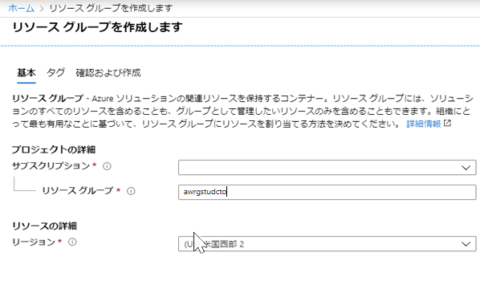
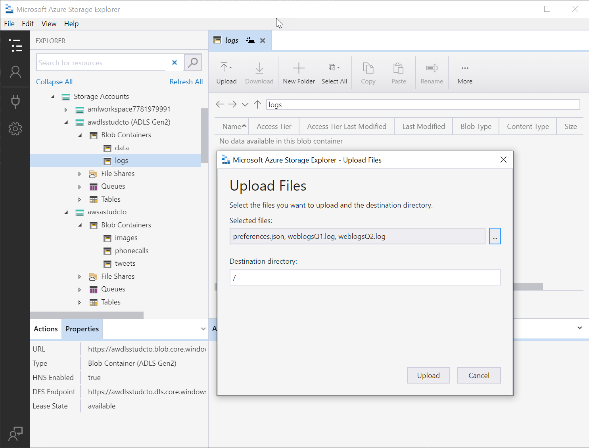

---
lab:
    title: 'データ ストレージの操作'
    module: 'モジュール 02: データ ストレージの操作'
---

# DP 200 - データ プラットフォーム ソリューションの実装
# ラボ 2 - データ ストレージの操作

**所要時間**: 60 分

**前提条件**: このラボのケース スタディは既に確認していることを前提としています。モジュール 1 の内容と課題は次を前提としています。データ エンジニア向け Azure も完了済みであること

**ラボ ファイル**: このラボのファイルは、_Allfiles\Labfiles\Starter\DP-200.2_ フォルダー内にあります。

## ラボの概要

このラボで、学生は特定のビジネスおよび技術に関する要件セットに対し、実装する適切なストレージのタイプを決定することができます。Azure ストレージ アカウントと Data Lake Storage アカウントを作成し、Data Lake Storage バージョン 1 とバージョン 2 の違いを説明できるようになります。選択したデータ ストレージへのデータの読み込みを実行する方法も説明できるようになります。

## ラボの目的
  
この課題を完了すると、次のことができるようになります。

1. Azure でのデータ ストレージ アプローチを選択する
1. Azure Storage アカウントを作成できる
1. Azure Data Lake Storage について説明する
1. Azure Data Lake にデータをアップロードできる

## シナリオ
  
あなたは、デジタル改革プロジェクトの一部であるテクノロジ ソリューションを実装するために、シニア データ エンジニアとして採用されました。組織は、会社の Web サイトをホストするインターネット インフォメーション サービス (IIS) を Azure に移行しています。開発者は、Web アプリケーションとそのロジックを Azure Web Apps に移行する処理を行っています。彼らは、Web サイトで使用される静的イメージをホストするために使用できるデータ ストアの準備をあなたに依頼しました。

さらに、情報サービス部門は、チームが拡大しており、予測分析ソリューションの構築プロセスを開始するデータ サイエンティストが間もなくチームに加わることを通知しました。作業の運用環境をホストするために使用するソリューションを設定するよう求められました。最初のインスタンスでは、ソリューションに対して作成する適切なストレージ層を評価します。

この作業を完了すると、次のことを行えるようになります。

1. Azure でのデータ ストレージ手法を選択した
2. Azure ストレージ アカウントを作成した
3. Azure Data Lake Storage について説明できる
4. Azure Data Lake にデータをアップロードする

> **重要**: このラボを進めるにつれ、プロビジョニングまたは構成タスクで発生した問題を書き留め、_\Labfiles\DP-200-Issues-Docx_にあるドキュメントの表に記録してください。ラボ番号を文書化し、テクノロジーを書き留め、問題とその解決を説明してください。このドキュメントは、後のモジュールで参照できるように保存します。

## エクササイズ 1: Azure でデータ ストレージ アプローチを選択する

所要時間: 15 分

個別エクササイズ
  
このエクササイズの主なタスク:

1. ケース スタディから、Web サイトの静的イメージおよび予測分析ソリューションのデータ ストレージ要件を特定します。

1. インストラクターは、調査結果についてグループと話し合います。

### タスク 1: AdventureWorks のデータ ストレージ要件と構造を特定します。

1. ラボの仮想マシンから **Microsoft Word** を起動し、**Allfiles\Labfiles\Starter\DP-200.2** フォルダーからファイル  **DP-200-Lab02-Ex01.docx** を開きます。

1. このラボのシナリオの説明に従って、**10 分間** でデータ ストレージ要件を文書化します。追加の参照資料として、ケース スタディ ドキュメントを使用することもできます。

### タスク 2: 調査結果についてインストラクターと話し合う

1. インストラクターは、調査結果について話し合うためにグループを中断させます。

> **結果**: このエクササイズの完了後には、データ ストレージ要件の 2 つのテーブルを示す Microsoft Word ドキュメントが作成されています。

## エクササイズ 2: Azure ストレージ アカウントを作成できる
  
所要時間: 20 分

個別エクササイズ
  
このエクササイズの主なタスクは次のとおりです。

1. 課題の場所に最も近いリージョンに **awrgstudxx** という名前の Azure リソース グループを作成します (**xx** には自分のイニシャルを入れます)。

1. リソース グループ awrgstudxx 内で、ラボの場所に最も近いリージョンに **awrgstudxx** という名前のストレージ アカウントを作成して構成します (**xx** には自分のイニシャルを入れます)。

1. awsastudxx ストレージ アカウント内に、**images**、**phonecalls** および **tweets** という名前のコンテナーを作成します。

1. ストレージ アカウントのイメージ コンテナーにグラフィックをアップロードします。

### タスク 1: リソース グループを作成して構成します。

1. 課題の仮想マシンから Microsoft Edge を起動し、[**http://portal.azure.com**](http://portal.azure.com) で Azure portal を開き、コース用に割り当てられているアカウントを使用してログインします。

1. Azure portal で、[**リソース グループ**] アイコンをクリックします。

1. [**リソース グループ**] 画面で、[**+ 追加**] をクリックし、次の設定を使用して最初のリソース グループを作成します。

    - **Subscription**: このラボで使用するサブスクリプションの名前
    
    - **リソース グループ名**: **awrgstudxx** (**xx** は自分のイニシャル)。

    - **リソース グループの場所**: 課題の場所に最も近い Azure リージョンと、Azure VM をプロビジョニングできる場所の名前

      > **注記**: サブスクリプションで使用可能な Azure リージョンを特定するには、[**https://azure.microsoft.com/ja-jp/regions/offers/**](https://azure.microsoft.com/ja-jp/regions/offers/) をご覧ください。

        

1. [リソース グループの作成] 画面で、[**確認および作成**] をクリックします。 

1. [リソース グループの作成] スクリーンで、[**作成**] をクリックします。 

> **注**: リソース グループの作成には約 30 秒かかります。通知領域を確認して、作成が完了した時点を確認できます。

### タスク 2: ストレージ アカウントを作成して構成する。

1. Azure portal で、スクリーンの左上にある [**ホーム**] ハイパーリンクをクリックします。

1. Azure portal で、[**+ リソースの作成**] アイコンをクリックします。

1. [新規作成] 画面で、[**マーケットプレースの検索**] テキスト ボックスをクリックし、「**ストレージ アカウント**」と入力します。表示される一覧の [**ストレージ アカウント - BLOB、ファイル、テーブル、キュー**] をクリックします。

1. [**ストレージ アカウント**] スクリーンで、[**作成**] をクリックします。

1. [**ストレージ アカウントの作成**] 画面から、次の設定を使用して最初のストレージ アカウントを作成します。

    - プロジェクトの詳細で、次の設定を指定します。

        - **Subscription**: このラボで使用するサブスクリプションの名前
    
        - **リソース グループ**: **awrgstudxx** (**xx** は自分のイニシャル)。

    - インスタンスの詳細で、次の設定を指定します。
    
        - **ストレージ アカウント名**: **awsastudxx** (**xx** は自分のイニシャル)

        - **場所**: ラボの場所に最も近い Azure リージョンの名前と、Azure VM をプロビジョニングできる場所。

        - **パフォーマンス**: **標準**。

        - **アカウントの種類**: **StorageV2 (general purpose v2)**。

        - **レプリケーション**: **読み取りアクセス geo 冗長ストレージ (RA_GRS)**

        - **アクセス層 (既定)**: **ホット**。

            

1. [**ストレージ アカウントの作成**] 画面で、[**確認および作成**] をクリックします。

1. [**ストレージ アカウントの作成***] スクリーンの検証後、[**作成**] をクリックします。

   > **注**: ストレージ アカウントを作成する際、定義した設定に基づくディスクとそのディスクの構成準備に約 90 秒かかります。

### タスク 3: ストレージ アカウント内でコンテナーを作成して構成する。

1. Azure portal で、[_デプロイが完了しました_] というメッセージが表示されたら、[**リソースに移動**] ボタンをクリックします。

1. **awsastudxx** (**xx** は自分のイニシャル) スクリーンで、[**BLOB サービス**] の下の [**コンテナー**] をクリックします。

1. [**awsastudxx - コンテナー**] スクリーンの左上で、[**+ コンテナー**] クリックします。

1. [**新しいコンテナー***] 画面から、次の設定を持つコンテナーを作成します。

    - 名前: **images**。

    - パブリック アクセス レベル: **プライベート (匿名アクセスなし)**

        

1. [**新しいコンテナー**] スクリーンで、[**OK**] をクリックします。

   > **注**: コンテナーはすぐに作成され、[**awrgstudxx - Containers**] スクリーンのリストに表示されます。

1. ステップ 4 から 5 を繰り返して、「**プライベート (匿名アクセスなし)**」のパブリック アクセス レベルで「**phonecalls**」という名前のコンテナーを作成します。

1. ステップ 4 から 5 を繰り返して、パブリック アクセス レベルが **プライベート (匿名アクセスなし)** で **tweets** という名前のコンテナーを作成します。画面は次の図のようになります。

    

### タスク 4: ストレージ アカウントのイメージ コンテナーにグラフィックをアップロードします。

1. Azure portal の [**awsastudxx - Containers**] スクリーンで、リストから [**画像**] 項目をクリックします。

1. [**画像**] スクリーンで、[**アップロード**] ボタンをクリックします。

1. [**BLOB のアップロード**] 画面内の [ファイル] テキスト ボックスで、テキスト ボックスの右側にある [**フォルダー**] アイコンをクリックします。

1. [**開く**] ダイアログ ボックスで、**Labfiles\Starter\DP-200.2\website graphics** フォルダーを開きます。次のファイルをハイライトします。

    - one.png

    - two.png

    - three.png

    - No.png

1. [**開く**] ダイアログ ボックスで、[**開く**] をクリックします。 

1. [**BLOB のアップロード**] 画面で、[**アップロード**] ボタンをクリックします。

1. [**BLOB のアップロード**] 画面を閉じ、[**画像**] 画面を閉じます。

1. [**awsastudxx - コンテナー**] 画面を閉じ、Azure portal で [**ホーム**] に移動します。 

   > **注**: ファイルのアップロードの所要時間は約 5 秒です。完了すると、[BLOB のアップロード] 画面のリストに表示されます。

> **結果**: このエクササイズを完了すると、AdventureWorks の Web サイトで使用できる 4 つのグラフィック ファイルを含む "images" という名前のコンテナーを有する awsastudxx という名前のストレージ アカウントが作成されます。

## エクササイズ 3: Azure Data Lake Storage について説明する
  
予想時間: 15 分

個別エクササイズ
  
このエクササイズの主なタスク:

1. リソース グループ awrgstudxx 内で、ラボの場所に最も近いリージョンに Data Lake Store Gen2 ストレージ タイプとして  **awdlsstudxx** という名前のストレージ アカウントを作成して構成します (**xx** は自分のイニシャル)。

1. awsastudxx ストレージ アカウント内に、**logs** および **data** という名前のコンテナーを作成します。

1. ストレージ アカウントのデータ コンテナーにデータ ファイルをアップロードします。

### タスク 1: Data Lake Store Gen II ストアとしてストレージ アカウントを作成して構成する。

1. Azure portal で、[**+ リソースの作成**] アイコンをクリックします。

1. [新規] 画面で、[**マーケット プレースの検索**] テキスト ボックスをクリックし、「**storage**」という単語を入力します。表示される一覧の [**ストレージ アカウント**] をクリックします。

1. [**ストレージ アカウント**] ブレードで [**作成**] をクリックします。

1. [**ストレージ アカウントの作成***] ブレードから、次の設定を使用してストレージ アカウントを作成します。

    - プロジェクトの詳細で、次の設定を指定します。

        - **Subscription**: このラボで使用するサブスクリプションの名前
    
        - **リソース グループ名**: **awrgstudxx** (**xx** は自分のイニシャル)。

    - インスタンスの詳細で、次の設定を指定します。

        - **ストレージ アカウント名**: **awdlsstudxx** (**xx** は自分のイニシャル)。

        - **場所**: ラボの場所に最も近い Azure リージョンの名前と、Azure VM をプロビジョニングできる場所。

        - **パフォーマンス**: **標準**。

        - **アカウントの種類**: **StorageV2 (general purpose v2)**。

        - **レプリケーション**: **読み取りアクセス geo 冗長ストレージ (RA_GRS)**

        - **アクセス層 (既定)**: **ホット**。

1. [**詳細**] タブをクリックします。

1. [Data Lake Storage Gen2] で、[**階層型名前空間**] の [**有効**] をクリックします。

    ![Azure portal の [ストレージ アカウントの作成] スクリーンでの階層型名前空間の設定の定義](Linked_Image_Files/M02-E03-T01-img01.png)

1. [**ストレージ アカウントの作成**] ブレードで、[**確認および作成**] をクリックします。

1. [**ストレージ アカウントの作成***] ブレードの検証後、[**作成**] をクリックします。

   > **注意**: ストレージ アカウントを作成する際、定義した設定に基づくディスクとディスクの構成のプロビジョニングに約 90 秒かかります。

### タスク 2: ストレージ アカウント内でコンテナーを作成して構成する。

1. Azure portal で、[_デプロイが完了しました_] というメッセージが表示されたら、[**リソースに移動**] ボタンをクリックします。

1. [**awdlsstudxx**] 画面で (**xx** は自分のイニシャル)、[**コンテナー**] をクリックします。

1. [**awrgstudxx - コンテナー**] 画面の左上で、[**+ コンテナー**] ボタンをクリックします。

1. [**新規**] 画面から、次の名前を使用して 2 つのファイル システムを作成します。

    - 名前: **data**。

    - 名前: **logs**

1. [**新しいコンテナー**] 画面で、[**OK**] をクリックします。

   > **注**: ファイル システムはすぐに作成され、次のように [**awdlsstudxx - コンテナー**] 画面のリストに表示されます。

    

> [**結果**]: このエクササイズを完了すると、data という名前のファイル システムを持つ awdlsstudxx という名前の Data Lake Gen2 ストレージ アカウントを作成できます。

## エクササイズ 4: Azure Data Lake にデータをアップロードする。
  
予想時間: 10 分

個別エクササイズ
  
このエクササイズの主なタスク:

1. Microsoft Azure Storage Explorer をインストールして起動する

1. Data Lake Gen II ストレージ アカウントのデータ コンテナーにデータ ファイルをアップロードする。

### タスク 1: Storage Explorer をインストールします。

1. Azure portal の [**awdlsstudxx - コンテナー**] 画面で、リストの [**データ**] 項目をクリックします。

1. Azure Data Lake Storage Gen2 が Storage Explorer で使用できるようになったことを示す画面が表示されます。[**Azure Storage Explorer のダウンロード**] ハイパーリンクをクリックします。

1. [[Azure Storage Explorer](https://azure.microsoft.com/ja-jp/features/storage-explorer/)] の次の Web ページが開き、[**今すぐダウンロード**] というボタンが表示されるので、そのボタンをクリックします。

1. Microsoft Edge ダイアログ ボックスで [**保存**] をクリックし、ダウンロードが完了したら、Microsoft Edge のダウンロード画面の [**ダウンロードの表示**] をクリックして、[**フォルダーを開く**] をクリックします。これで [ダウンロード] フォルダーが開きます。

1. ファイル **StorageExplorer.exe** をダブルクリックし、[ユーザー アカウント制御] ダイアログ ボックスで [**はい**] をクリックします。

1. [使用許諾契約書] 画面で、[**同意する**] の横にあるラジオ ボタンを選択し、[**インストール**] をクリックします。

   > **注記**: Storage Explorer のインストールには約 4 分かかります。Azure Storage Explorer を使用すると、Azure Storage Explorer でストレージ アカウントの内容を簡単に管理できます。BLOB、ファイル、キュー、テーブル、および Cosmos DB エンティティをアップロード、ダウンロード、および管理することができます。また、簡単にアクセスして仮想マシン ディスクを管理することもできます。

1. インストールが完了したら、[**Microsoft Azure Storage Explorer の起動**] の横にあるチェックボックスがオンになっていることを確認してから、[**完了**] をクリックします。Microsoft Azure Storage Explorer が開き、サブスクリプションが一覧表示されます。

1. Storage Explorerで、[**アカウントを管理する**] を選択し、[**アカウント管理パネル**] に移動します。

1. 左側のペインに、サインインしたすべての Azure アカウントが表示されます。別のアカウントに接続するには、[**アカウントを追加**] を選択します。

1. ナショナル クラウドまたは Azure Stack にサインインする場合は、Azure 環境ドロップダウンをクリックして、使用したい Azure クラウドを選択します。環境を選択したら、[**サインイン...**] ボタンをクリックします。

1. Azure アカウントを利用して正常にサインインすると、そのアカウントに関連付けられているアカウントと Azure サブスクリプションが左側のペインに追加されます。操作したい Azure サブスクリプションを選択し、[**適用**] を選択します。左側のペインには、選択した Azure サブスクリプションに関連付けられたストレージ アカウントが表示されます。

    

### タスク 2: Data Lake Gen II ストレージ アカウントのデータ コンテナーにデータ ファイルをアップロードする。

1. Azure Storage Explorer で、矢印をクリックしてサブスクリプションを展開します。

1. [**ストレージ アカウント**] で、ストレージ アカウント [**awdlsstudxx (ADLS Gen2)**] を検索し、矢印をクリックして展開します。

1. [**BLOB コンテナー**] で矢印をクリックして展開し、[**ログ**] ファイル システムを表示します。[**ログ**] ファイル システムをクリックします。

1. Azure Storage Explorer で、[**アップロード**] アイコンの横にある矢印をクリックし、[**ファイルのアップロード**] をクリックします。

1. [ファイルのアップロード] ダイアログ ボックスで、[**選択したファイル**] テキスト ボックスの横にある省略記号をクリックします。

1. [**アップロードするファイルの選択**] ダイアログ ボックスで、**Labfiles\Starter\DP-200.2\logs** フォルダーを参照します。次のファイルをハイライトします。

    - weblogsQ1.log

    - weblogsQ2.log

    - preferences.json

1. [**アップロードするファイルの選択**] ダイアログ ボックスで、[**開く**] をクリックします。

1. [**ファイルのアップロード**] スクリーンで、[**アップロード**] をクリックします。

   

1. [**BLOB コンテナー**] の下で矢印をクリックして展開し、[**データ**] ファイル システムを表示します。[**データ**] ファイル システムをクリックします。

1. Azure Storage Explorer で、[**アップロード**] アイコンの横にある矢印をクリックし、[**ファイルのアップロード**] をクリックします。

1. [ファイルのアップロード] ダイアログ ボックスで、[**選択したファイル**] テキスト ボックスの横にある省略記号をクリックします。

1. [**アップロードするファイルの選択**] ダイアログ ボックスで、**Labfiles\Starter\DP-200.2\Static Files** フォルダーを開きます。次のファイルをハイライトします。

    - DimDate2.txt

1. [**アップロードするファイルの選択**] ダイアログ ボックスで、[**開く**] をクリックします。

1. [**ファイルのアップロード**] 画面で、[**アップロード**] ボタンをクリックします。

1. 手順を繰り返して、preferences.JSON ファイルを **Labfiles\Starter\DP-200.2\logs** フォルダーから Data Lake Store gen2 の**データ** ファイル システムにアップロードします。

   > **注**: ファイルのアップロードの所要時間は約 5 秒です。「**ビューが最新でない可能性があります。**」というメッセージが Azure Storage Explorer に表示されています。**更新しますか? [はい] をクリックします**。完了すると、2 つのファイルすべてが BLOB のアップロード スクリーンのリストに表示されます。

    

1. Azure Storage Explorer のデータ ファイル システムで、[**+ 新しいフォルダー**] をクリックします。 

1. [新しいフォルダー] スクリーンの [新しいフォルダー名] テキスト ボックスに、**output**」を入力します。

1. Azure Storage Explorer を閉じます。

1. Azure portal に戻り、[**ホーム**] ブレードに移動します。

> **結果**: このエクササイズを完了すると、2 つの Web ログ ファイルを含む「data」という名前のファイル システムを有する awdlsstudxx という名前の Data Lake Gen II ストレージ アカウントが作成され、AdventureWorks のデータ サイエンティストがそれを使用できるようになります。
