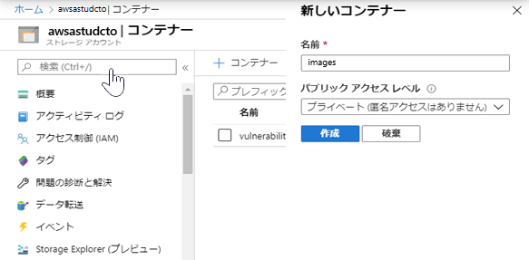
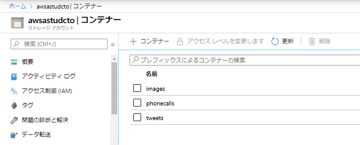
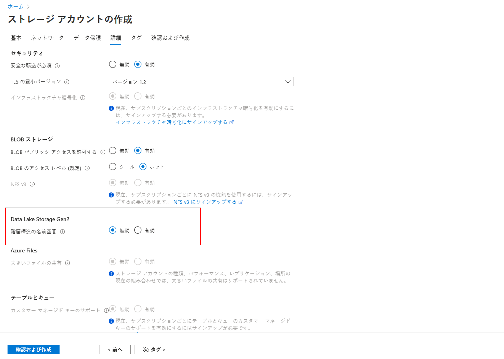

---
lab:
    title: 'データ ストレージの使用'
    module: 'モジュール 02: データ ストレージの操作'
---

# DP 200 - データ プラットフォーム ソリューションの実装
# ラボ 2 - データ ストレージの使用

**所要時間**: 60 分

**前提条件**: このラボのケース スタディは既に確認していることを前提としています。モジュール 1 のAzure for the Data Engineer のコースとラボも完了済みであることを前提としています。

**ラボ ファイル**: このラボのファイルは、_Allfiles\Labfiles\Starter\DP-200.2_ のフォルダーにあります。

## ラボの概要

このラボでは、特定のビジネス要件と技術要件に対して実装する適切なストレージのタイプを決定する方法について説明します。このラボをとおして、受講生は Azure ストレージ アカウントと Data Lake Storage アカウントを作成し、Data Lake Storage バージョン 1 とバージョン 2 の違いを説明できるようになります。また、選択したデータ ストレージへのデータの読み込みを実行する方法を説明することもできるようになります。

## ラボの目的
  
このラボを完了すると、次のことができるようになります。

1. Azure でデータ ストレージ アプローチを選択する
1. Azure ストレージ アカウントを作成する
1. Azure Data Lake Storage について説明する
1. Azure Data Lake にデータをアップロードする

## シナリオ
  
あなたは、デジタル トランスフォーメーション プロジェクトの一部であるテクノロジー ソリューションを実装するために、シニア データ エンジニアとして採用されました。組織は、会社の Web サイトをホストするインターネット インフォメーション サービス (IIS) を Azure に移行しようとしています。開発者は、Web アプリケーションとそのロジックを Azure Web Apps に転送中で、Web サイトで使用される静的イメージのホストに使用できるデータ ストアの準備をあなたに依頼しました。

さらに、情報サービス部門は、チームが拡大しており、予測分析ソリューションの構築プロセスを開始するデータ サイエンティストが間もなくチームに加わることを通知しました。作業の運用環境をホストするために使用するソリューションを設定するのがあなたの仕事です。最初のインスタンスでは、ソリューションに対して作成する適切なストレージ層を評価します。

この作業を完了すると、受講者は次のことができるようになります。

1. Azure でのデータ ストレージ手法を選択する
2. Azure Storage アカウントを作成する
3. Azure Data Lake Storage について説明する
4. Azure Data Lake にデータをアップロードする

> **重要**: このラボを進めるにつれ、プロビジョニングまたは構成タスクで発生したすべての問題を書き留め、_\Labfiles\DP-200-Issues-Docx_ にあるドキュメントの表に記録してください。ラボ番号を文書化し、テクノロジーを書き留め、問題とその解決を説明してください。このドキュメントは、後のモジュールで参照できるように保存します。

## 演習 1: Azure でデータ ストレージ アプローチを選択する

所要時間: 15 分

個別演習
  
この演習の主なタスク:

1. ケース スタディから、Web サイトの静的イメージおよび予測分析ソリューションのデータ ストレージ要件を特定します。

1. インストラクターは、調査結果についてグループと話し合います。

### タスク 1: AdventureWorks のデータ ストレージ要件と構造を特定する。

1. ラボの仮想マシンから **Microsoft Word** を起動し、**Allfiles\Labfiles\Starter\DP-200.2** フォルダーからファイル **DP-200-Lab02-Ex01.docx** を開きます。

1. このラボのシナリオの説明に従って、**10 分間**でデータ ストレージ要件を文書化します。追加の参照資料として、ケース スタディ ドキュメントを使用することもできます。

### タスク 2: 調査結果について講師と話し合う

1. インストラクターは、調査結果について話し合うためにグループ作業を中断させます。

> **結果**: この演習を完了すると、データ ストレージ要件の 2 つの表を示す Microsoft Word ドキュメントが作成されます。

## 演習 2: Azure ストレージ アカウントを作成する
  
所要時間: 20 分

個別演習
  
この演習の主なタスク:

1. ラボの場所に最も近いリージョンに **awrgstudxx** という名前の Azure リソース グループを作成します (**xx**は自分のイニシャル)。

1. リソース グループ awrgstudxx 内で、ラボの場所に最も近いリージョンに **awrgstudxx** という名前のストレージ アカウントを作成して構成します (**xx** は自分のイニシャル)。

1. awsastudxx ストレージ アカウント内に、**images**、**phonecalls**、**tweets** という名前のコンテナーを作成します。

1. ストレージ アカウントのイメージ コンテナーにグラフィックをアップロードします。

### タスク 1: リソース グループを作成して構成する。

1. ラボの仮想マシンから Microsoft Edge を起動し、[**http://portal.azure.com**](http://portal.azure.com) で Azure portal を開き、コースで自分に割り当てられているアカウントを使用してサインインします。

1. Azure portal で、「**リソース グループ**」アイコンをクリックします。

1. 「**リソース グループ**」画面で、「**+ 追加**」をクリックし、次の設定を使用して最初のリソース グループを作成します。

    - **サブスクリプション**: このラボで使用するサブスクリプションの名前
    
    - **リソース グループ名**:  **awrgstudxx** (**xx** は自分のイニシャル)

    - **リソース グループの場所**: ラボの場所に最も近い Azure リージョンの名前と、Azure VM をプロビジョニングできる場所。

      > **注記**: サブスクリプションで使用可能な Azure リージョンを特定するには、[**https://azure.microsoft.com/ja-jp/regions/offers/**](https://azure.microsoft.com/ja-jp/regions/offers/) をご覧ください。

        

1. 「リソース グループの作成」画面で、「**Review + Create**」 (確認と作成) をクリックします。

1. 「リソース グループの作成」画面で、「**作成**」をクリックします。

> **注**: リソース グループの作成には約 30 秒かかります。登録が完了した時点で通知領域を確認して確認できます。

### タスク 2: ストレージ アカウントを作成して構成する。

1. Azure portal の画面左上の「**ホーム**」ハイパーリンクをクリックします

1. Azure portal で、「**+ リソースの作成**」をクリックします。

1. 「新規」画面で、「**マーケットプレースを検索**」テキスト ボックスに移動し、「**storage account**」と入力します。表示される画面で「**Storage account - blob, file, table, queue**」 (ストレージ アカウント - blob、ファイル、テーブル、キュー) をクリックします。

1. 「**ストレージ アカウント**」画面で、「**作成**」をクリックします。

1. 「**ストレージ アカウントの作成**」画面から、次の設定を使用して最初のストレージ アカウントを作成します。

    - プロジェクトの詳細で、次の設定を指定します。

        - **サブスクリプション**: このラボで使用するサブスクリプションの名前
    
        - **リソース グループ**: **awrgstudxx** (**xx** は自分のイニシャル)

    - インスタンスの詳細の下で、次の設定を指定します。
    
        - **ストレージ アカウント名**: **awsastudxx** (**xx** は自分のイニシャル)

        - **場所**: ラボの場所に最も近い Azure リージョンの名前と、Azure VM をプロビジョニングできる場所。

        - **パフォーマンス**: **標準**。

        - **アカウントの種類**: **StorageV2 (general purpose v2)**。

        - **レプリケーション**: **読み取りアクセス geo-リダンダント ストレージ- (RA_GRS)**

        - **アクセス層 (既定)**: **ホット**。

            

1. 「**ストレージ アカウントの作成**」画面で、「**Review + create**」 (確認と作成) をクリックします。

1. 「**ストレージ アカウントの作成***」画面を検証してから、「**作成**」をクリックします。

   > **注**: ストレージ アカウントを作成する際、定義した設定に基づくディスクとそのディスクの構成準備に約 90 秒かかります。

### タスク 3: ストレージ アカウント内でコンテナーを作成して構成する。

1. Azure portal で、「_デプロイが完了しました_」というメッセージが表示されたら、「**リソースに移動**」ボタンをクリックします。

1. **Awsastudxx** (**xx** は自分のイニシャル) 画面で、「**BLOB サービス**」の下の「**コンテナー**」をクリックします。

1. 「**awsastudxx - コンテナー**」画面の左上にある「**+ コンテナー**」ボタンをクリックします。

1. 「**新しいコンテナー***」画面から、次の設定を持つコンテナーを作成します。

    - 名前: **images**。

    - パブリック アクセス レベル: **非公開 (匿名アクセスなし)**

        

1. 「**新しいコンテナー**」画面で、「**作成**」をクリックします。

   > **注**: コンテナーはすぐに作成され、「**awrgstudxx - コンテナー**」画面のリストに表示されます。

1. ステップ 4 から 5 を繰り返して、パブリック アクセス レベルが「**プライベート (匿名アクセスなし)**」で「**phonecalls**」という名前のコンテナーを作成します。

1. ステップ 4 から 5 を繰り返して、パブリック アクセス レベルが「**プライベート (匿名アクセスなし)**」で「**tweets**」という名前のコンテナーを作成します。次の図のように表示されます。

    

### タスク 4: ストレージ アカウントのイメージ コンテナーにグラフィックをアップロードします。

1. Azure portal の「**awsastudxx - コンテナー**」画面で、リストから「**画像**」項目をクリックします。

1. 「**画像**」画面で、「**アップロード**」ボタンをクリックします。

1. **BLOB のアップロード**画面内の**ファイル**テキスト ボックスで、テキスト ボックスの右側にあるフォルダー アイコンをクリックします。

1. **開く**ダイアログ ボックスで、**Labfiles\Starter\DP-200.2\website graphics**フォルダーを開きます。次のファイルをハイライトします。

    - one.png

    - two.png

    - three.png

    - No.png

1. 「**開く**」ダイアログ ボックスで、「**開く**」をクリックします。 

1. 「**BLOB のアップロード**」画面で、「**アップロード**」ボタンをクリックします。

1. 「**BLOB のアップロード**」画面を閉じ、「**イメージ**」画面を閉じます。

1. 「**awsastudxx - コンテナー**」画面を閉じ、Azure portal で「**ホーム**」画面に移動します。 

   > **注**: ファイルのアップロードの所要時間は約 5 秒です。完了すると、「BLOB のアップロード」画面のリストに表示されます。

> **結果**: この演習を完了すると、AdventureWorks の Web サイトで使用できる 4 つのグラフィック ファイルを含む 「images」 という名前のコンテナーを有する awsastudxx という名前のストレージ アカウントが作成されます。

## 演習 3: Azure Data Lake Storage について説明する
  
所要時間: 15 分

個別演習
  
この演習の主なタスク:

1. リソース グループ awrgstudxx 内 (**xx**には自分のイニシャル)で、ラボの場所に最も近いリージョンに Data Lake Store Gen 2 ストレージ タイプとして **awdlsstudxx** という名前のストレージ アカウントを作成して構成します。

1. awsastudxx ストレージ アカウント内に、**logs** および **data** という名前のコンテナーを作成します。

### タスク 1: Data Lake Store Gen II ストレージとしてストレージ アカウントを作成して構成する。

1. Azure portal で、「**+ リソースの作成**」アイコンをクリックします。

1. 「新規」画面で、「**マーケットプレースを検索**」テキスト ボックスに移動し、「**storage**」と入力します。表示される一覧から「**ストレージ アカウント**」をクリックします。

1. 「**ストレージ アカウント**」ブレードで、「**作成**」をクリックします。

1. 「**ストレージ アカウントの作成***」ブレードから、次の設定を使用してストレージ アカウントを作成します。

    - プロジェクトの詳細で、次の設定を指定します。

        - **サブスクリプション**: このラボで使用するサブスクリプションの名前
    
        - **リソース グループ名**: **awrgstudxx** (**xx** は自分のイニシャル)

    - インスタンスの詳細の下で、次の設定を指定します。

        - **ストレージ アカウント名**: **awdlsstudxx** (**xx** は自分のイニシャル)

        - **場所**: ラボの場所に最も近い Azure リージョンの名前と、Azure VM をプロビジョニングできる場所。

        - **パフォーマンス**: **標準**。

        - **アカウントの種類**: **StorageV2 (general purpose v2)**。

        - **レプリケーション**: **読み取りアクセス geo-リダンダント ストレージ- (RA_GRS)**

        - **アクセス層 (既定)**: **ホット**。

1. 「**詳細**」タブをクリックします。

1. 「Data Lake Storage Gen2」の下で、「**階層型名前空間**」の下の「**有効**」をクリックします。

    

1. 「**ストレージ アカウントの作成**」ブレードで、「**Review + create**」 (確認と作成) をクリックします。

1. 「**ストレージ アカウントの作成***」ブレードを検証してから、「**作成**」をクリックします。

   > **注**: ストレージ アカウントを作成する際、定義した設定に基づくディスクとそのディスクの構成準備に約 90 秒かかります。

### タスク 2: ストレージ アカウント内でコンテナーを作成して構成する。

1. Azure portal で、「_デプロイが完了しました_」というメッセージが表示されたら、「**リソースに移動**」ボタンをクリックします。

1. **awdlsstudxx**」画面で (**xx** は自分のイニシャル)、「**コンテナー**」をクリックします。

1. 「**awrgstudxx - コンテナー**」画面の左上にある「**+ コンテナー**」ボタンをクリックします。

1. 「**新規**」画面から、次の 2 つの名前のコンテナーを作成します。

    - 名前: **data**。

    - 名前: **logs**。

1. 「**新しいコンテナー**」画面で、「**作成**」をクリックします。

   > **注**: ファイル システムはすぐに作成され、「**awdlsstudxx - コンテナー**」画面のリストに表示されます。

    

> **結果**: この演習を完了すると、data という名前のファイル システムを持つ awdlsstudxx という名前のData Lake Gen 2 ストレージ アカウントが作成されます。

## 演習 4: Azure Data Lake にデータをアップロードする。
  
所要時間: 10 分

個別演習
  
この演習の主なタスク:

1. Microsoft Azure Storage Explorer をインストールして起動する

1. Data Lake Gen 2 ストレージ アカウントのデータ コンテナーにデータ ファイルをアップロードする。

### タスク 1: Storage Explorer をインストールする。

1. Azure portal の「**awdlsstudxx - コンテナー**」画面で、リストから「**データ**」項目をクリックします。

1. 「**概要**」をクリックし、「**エクスプローラーで開く**」をクリックし、「**Azure Storage Explorer をダウンロードする**」ハイパーリンクをクリックします。

1. [Azure Storage Explorer](https://azure.microsoft.com/ja-jp/features/storage-explorer/) の次の Web ページが開き、「**今すぐダウンロード**」というボタンが表示されるので、そのボタンをクリックします。

1. Microsoft Edge ダイアログ ボックスで「**保存**」をクリックし、ダウンロードが完了したら、Microsoft Edge のダウンロード画面の「**ダウンロードの表示**」をクリックして、「**フォルダーを開く**」をクリックします。これでダウンロード フォルダーが開きます。

1. ファイル **StorageExplorer.exe** をダブルクリックし、ユーザー アカウント制御ダイアログ ボックスで「**はい**」をクリックします。

1. 「使用許諾契約書」画面で、「**同意する**」の横にあるラジオ ボタンを選択し、「**インストール**」をクリックします。

   > **注**: Storage Explorer のインストールには約 4 分かかります。Azure Storage Explorer を使用すると、Azure Storage Explorer でストレージ アカウントの内容を簡単に管理できます。BLOB、ファイル、キュー、テーブル、および Cosmos DB エンティティをアップロード、ダウンロード、および管理することができます。また、簡単にアクセスして仮想マシン ディスクを管理することもできます。

1. インストールが完了したら、「**Microsoft Azure Storage Explorer の起動**」の横にあるチェックボックスがオンになっていることを確認し、「**完了**」をクリックします。Microsoft Azure Storage Explorer が開き、サブスクリプションが一覧表示されます。

1. ストレージ エクスプローラーで、**アカウントを管理する**を選択し、**アカウント管理パネル**に移動します。

1. 左側のペインに、サインインしているすべての Azure アカウントが表示されます。別のアカウントに接続するには、**アカウントを追加**を選択します。

1. ナショナル クラウドまたは Azure Stack にサインインする場合は、Azure 環境ドロップダウンをクリックして、使用したい Azure クラウドを選択します。環境を選択したら、**サインイン**ボタンをクリックします。

1. Azure アカウントを利用して正常にサインインすると、そのアカウントに関連付けられているアカウントと Azure サブスクリプションが左側のペインに追加されます。操作したい Azure サブスクリプションを選択し、**適用**を選択します。左側のペインには、選択した Azure サブスクリプションと関連付けられているストレージ アカウントが表示されます。

    

### タスク 2: Data Lake Gen II ストレージ アカウントのデータおよびログのコンテナーにデータ ファイルをアップロードする。

1. Azure Storage Explorer で、矢印をクリックしてサブスクリプションを展開します。

1. 「**ストレージ アカウント**」の下で、ストレージ アカウント **awdlsstudxx (ADLS Gen2)** を検索し、矢印をクリックして展開します。

1. 「**BLOB コンテナー**」の下で、矢印をクリックして展開し、**ログ** ファイル システムを表示します。**ログ** ファイル システムをクリックします。

1. Azure Storage Explorer で、「**アップロード**」アイコンの横にある矢印をクリックし、「**ファイルのアップロード**」をクリックします。

1. 「ファイルのアップロード」ダイアログ ボックスで、「**選択したファイル**」テキスト ボックスの横にある省略記号をクリックします。

1. **アップロードするファイルの選択**ダイアログ ボックスで、**Labfiles\Starter\DP-200.2\logs**フォルダーを開きます。次のファイルをハイライトします。

    - weblogsQ1.log

    - weblogsQ2.log

    - preferences.json

1. 「**アップロードするファイルの選択**」ダイアログ ボックスで、「**開く**」をクリックします。

1. 「**ファイルのアップロード**」画面で、「**アップロード**」ボタンをクリックします。

   

1. 「**BLOB コンテナー**」の下で矢印をクリックして展開し、**データ**ファイル システムを表示します。**データ**ファイル システムをクリックします。

1. Azure Storage Explorer で、「**アップロード**」アイコンの横にある矢印をクリックし、「**ファイルのアップロード**」をクリックします。

1. 「ファイルのアップロード」ダイアログ ボックスで、「**選択したファイル**」テキスト ボックスの横にある省略記号をクリックします。

1. 「**アップロードするファイルの選択**」ダイアログ ボックスで、**Labfiles\Starter\DP-200.2\Static Files** フォルダーを参照します。次のファイルをハイライトします。

    - DimDate2.txt

1. 「**アップロードするファイルの選択**」ダイアログ ボックスで、「**開く**」をクリックします。

1. 「**ファイルのアップロード**」画面で、「**アップロード**」ボタンをクリックします。

1. この手順を繰り返して、**Labfiles\Starter\DP-200.2\logs** フォルダーから、Data Lake Store gen2 内の**データ** ファイル システムに .JSON ファイルをアップロードします。

   > **注**: ファイルのアップロードの所要時間は約 5 秒です。Azure Storage Explorer のメッセージに、「**ビューが最新でない可能性があります。更新しますか?」というメッセージが表示されます。「はい」をクリックします**。完了すると、「BLOB のアップロード」画面のリストに 2 つのすべてのファイルが表示されます。

    

1. Azure Storage Explore のデータ ファイル システムで「**+ 新しいフォルダー**」ボタンをクリックします。

1. 「新しいフォルダー」画面の「新しいフォルダー名」テキスト ボックスに、「**output**」と入力します。

1. Azure Storage Explorer を閉じます。

1. Azure portal に戻り、「**ホーム**」ブレードに移動します。

> **結果**: この演習を完了すると、2 つの Web ログ ファイルを含む 「data」 という名前のファイル システムを有する awdlsstudxx という名前の Data Lake Gen II Storage アカウントが作成され、AdventureWorks のデータ サイエンティストがそれを使用できるようになります。
