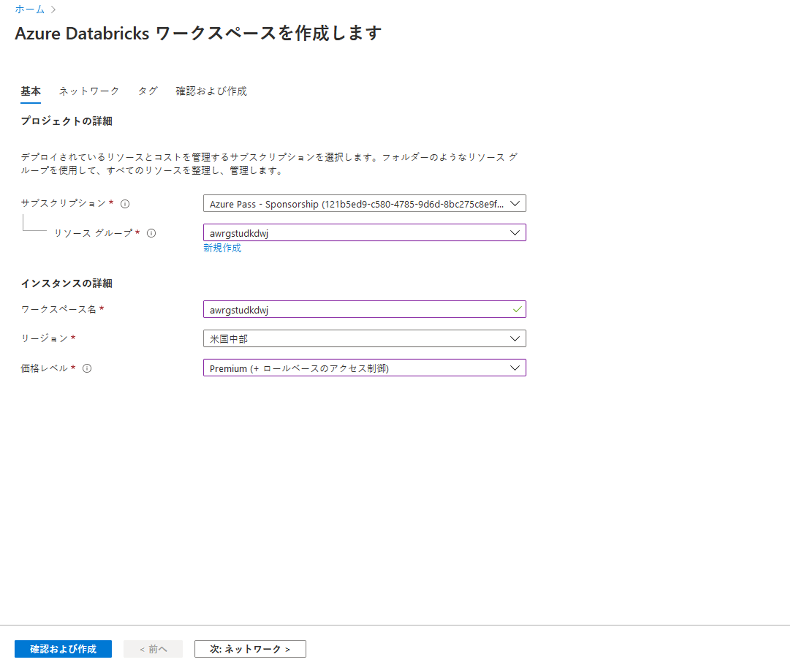
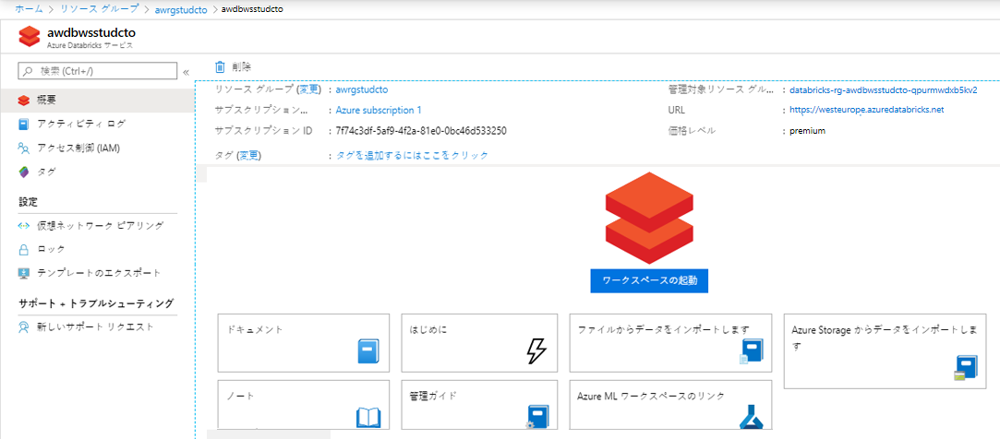
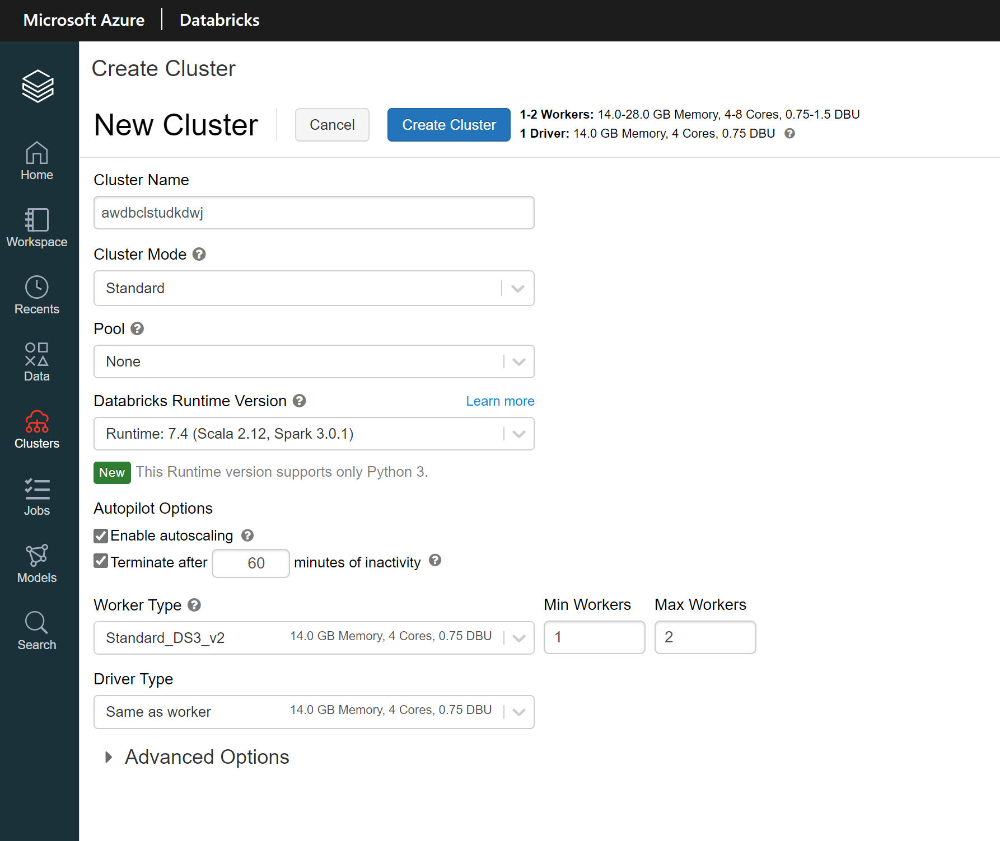
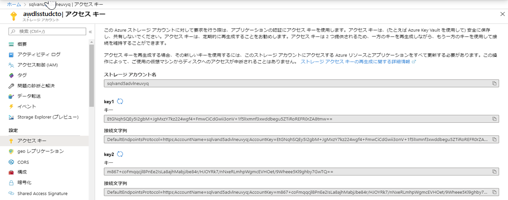
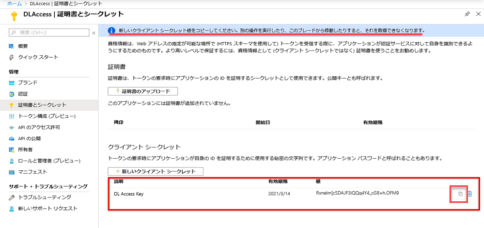
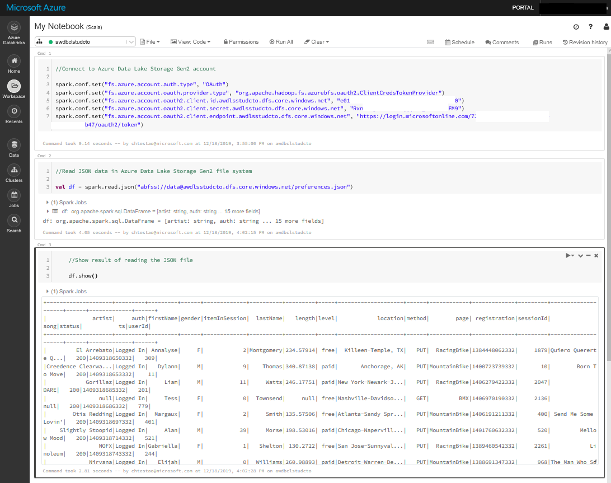

---
lab:
    title: 'Azure Databricks でのチーム ベースのデータ サイエンスの有効化'
    module: 'モジュール 3: Azure Databricks でのチーム ベースのデータ サイエンスの有効化'
---

# DP 200 - データ プラットフォーム ソリューションの実装
# ラボ 3 - Azure Databricks でのチーム ベースのデータ サイエンスの有効化

**推定時間**: 75 分

**前提条件**: このラボのケース スタディは、読み取り済みであることを前提としています。モジュール 1 の内容とラボを前提としています。Azure for the Data Engineer も完了しています。

**ラボ ファイル**: このラボのファイルは、_Allfiles\Labfiles\Starter\DP-200.3_のフォルダーにあります。

## 課題の概要

この課題を修了すると、受講者は Azure Databricks をデータ サイエンス プロジェクトの支援に使用する理由を説明できるようになります。受講者は、Azure Databricks インスタンスをプロビジョニングし、Data Lake Store Gen II ストアから簡単なデータ準備タスクを実行するために使用されるワークスペースを作成します。最後に、学生は Azure Databricks を使用して、変換の実行を通しで実行します。

## 課題の目的
  
このラボを完了すると、次のことができるようになります。

1. Azure Databricks について説明する
1. Azure Databricks で作業する
1. Azure Databricks を使用してデータを読み取る
1. Azure Databricks を使用して変換を実行する

## シナリオ
  
情報サービス (IS) 部署に対応して、このテクノロジを使用する利点を列挙して、予測分析プラットフォームを構築するプロセスを開始します。部署にはデータ科学者が加わるので、新しいチーム メンバーが予測分析環境を利用できるようにしたいと思っています。

あなたは、Azure Databricks 環境を立ち上げてプロビジョニングし、既存の Data Lake Storage Gen 2 アカウントからデータを取り込むことで、サービス上で単純なデータ準備ルーチンを実行して、この環境が機能することをテストします。データ エンジニアとして、データ サイエンティストがデータ準備作業を行うことをあなたが支援する必要があるかもしれないことが提案されています。そのためには、基本的な変換を実行するのに役立つノートブックを通しで確認することをお勧めします。

このラボを完了すると:

1. Azure Databricks について説明した
1. Azure Databricks を使用しました
1. Azure Databricks を使用してデータを読み取る
1. Azure Databricks を使用して変換を実行した

> **重要**: このラボを進めるにつれ、プロビジョニングまたは構成タスクで発生した問題を書き留め、_\Labfiles\DP-200-Issues-Docx_にあるドキュメントの表に記録してください。ラボ番号を記述し、テクノロジーを書き留め、その問題と解決内容を説明します。このドキュメントは、後のモジュールで参照できるように保存します。

## エクササイズ 1: Azure Databricks について説明する

>**重要**: **最初にエクササイズ 2** を実行し、エクササイズ 2 で Databricks クラスターの作成を開始した後 (プロビジョニングに10 分間かかるため) にエクササイズ 1 に戻ります。

所要時間: 15 分

個別エクササイズ
  
このエクササイズの主なタスクは、以下の通りです。

1. このコースでこれまでに学習した内容から、Azure Databricks が満たすデジタル環境の変革要件と、Azure Databricks の候補データ ソースを特定します。

1. インストラクターは、検出結果についてグループと話し合います。

### タスク 1: デジタル変革と候補データ ソースを定義します。

1. ラボの仮想マシンから **Microsoft Word** を起動し、**Allfiles\Labfiles\Starter\DP-200.3** フォルダーからファイル **DP-200-Lab03-Ex01.docx** を開きます。

1. この課題のケース スタディとシナリオの概説に従って、**10 分間** でデジタル環境の変革要件と候補データ ソースを文書化します。

### タスク 2: 調査結果について講師と話し合う

1. 講師は、調査結果について話し合うためにグループ作業を中断させます。

> **結果**: このエクササイズを完了すると、Azure Databricks が満たすデジタル環境の変革要件と候補データ ソースを識別する Microsoft Word ドキュメントが作成されます。

## 実習 2: Azure Databricks を使用する
  
推定時間: 20 分

個別エクササイズ
  
このエクササイズの主なタスクは以下の通りです。

1. リソース グループに Azure Databricks Premium 層インスタンスを作成する。

1. Azure Databricks を開く

1. Databricks ワークスペースを起動し、Spark クラスターを作成する

### タスク 1: Azure Databricks インスタンスを作成して構成する。

1. スクリーンの左上にある Azure portal で、「**ホーム**」 ハイパーリンクをクリックします 。

1. Azure portal で、「**+ リソースの作成**」 アイコンをクリックします。

1. 新規のスクリーンで、**マーケットプレースの検索** テキスト ボックスに移動し、**databricks** という単語を入力します。表示される一覧で「**Azure Databricks**」 をクリックします。

1. **Azure Databricks** ブレードで **作成** をクリックします。

1. **Azure Databricks のサービス** ブレードから、次の設定を使用してAzure Databricks ワークスペースを作成します。

    - **ワークスペース名**：**Warehousexx**、 (**xx** は、お客様のイニシャルです)

    - **Subscription**: このラボで使用するサブスクリプションの名前

    - **リソース グループ**: **awrgstudxx** (**xx** は自分のイニシャル)。

    - **場所**: ラボの場所に最も近い Azure リージョンの名前と、Azure VM をプロビジョニングできる場所。

    - **価格レベル**: **Premium (+ ロールベースのアクセス制御)**。

    - **仮想ネットワークに Azure Databricks ワークスペースをデプロイします**：**いいえ**。

        

1. **Azure Databricks サービス** ブレードで、**作成** をクリックします。

   > **注**: プロビジョニングの所要時間は約 3 分です。Databricks Runtime は Apache Spark の上に構築され、Azure クラウド用にネイティブに構築されます。Azure Databricks は、インフラストラクチャの複雑性を完全に排除しており、データ インフラストラクチャの設定と構成に関する専門知識も必要ありません。プロダクション ジョブのパフォーマンスを気にするデータ エンジニアに対して、Azure Databricks は、I/O 層と処理層 (Databricks I/O) でさまざまな最適化を行い、より高速でパフォーマンスの高い Spark エンジンを提供します。
   
### タスク 2: Azure Databricks を開く

1. Azure Databricks サービスが作成されたことを確認します。

1. Azure portal で、**リソース グループ** スクリーンに移動します。

1. リソース グループ スクリーンで、**awrgstudxx** リソース グループ (**xx** はお客様のイニシャル) をクリックします。

1. **awrgstudxx** スクリーンで、**awdbwsstudxx** (**xx** お客様のイニシャル) をクリックして、Azure Databricks を開きます。これで、Azure Databricks サービスが開きます。

    

### タスク 3: Databricks ワークスペースを起動し、Spark クラスターを作成する。

1. Azure portal の **awdbwsstudxx** スクリーンで、**ワークスペースの起動** ボタンをクリックします。

    > **注**: Microsoft Edge の別のタブで、Azure Databricks ワークスペースにサインインします。

1. **一般的なタスク** で、**新規クラスター** をクリック します。

1. **クラスターの作成** スクリーンの 「新規クラスター」 で、次の設定を使って Databricks クラスターを作成し、「**クラスターの作成**」 をクリックします。

    - **クラスター名**: **awdbclstudxx** (**xx** はお客様のイニシャル)

    - **クラスター モード**: **Standard**

    - **プール**：**なし**

    - **Databricks ランタイムのバージョン**: **ランタイム：6.6 (Scala 2.11、Spark 2.4.5)**

    - 「アクティビティが **60 分間ない場合は終了する**」 チェック ボックスをオンにします。クラスターが使われていない場合にクラスターを終了するまでの時間 (分単位) を指定します。

    - 残りのオプションはすべて現在の設定のままにしておきます。

        

1. **クラスターの作成** スクリーンで、**クラスターの作成** をクリックし、Microsoft Edge スクリーンを開いたままにします。

> **注記**: グラフィカル ユーザー インターフェイスを使用して Spark クラスターの作成が簡略化されるため、Azure Databricks インスタンスの作成には約 10 分かかります。クラスターの作成中は、**状態** が **保留中** になります。クラスターが作成されると、**実行中** に変わります。

> **注記**: クラスターの作成中に、**エクササイズ 1に戻って実行します**。

## エクササイズ 3: Azure Databricks を使用してデータを読み取る

推定時間: 30 分

個別エクササイズ

このエクササイズの主なタスクは以下の通りです。

1. Databricks クラスターが作成されたことを確認します。

1. Azure Data Lake Store Gen II アカウント名を収集します

1. Databricks インスタンスを有効にして、Data Lake Gen II Store にアクセスする。

1. Databricks ノートブック を作成し、Data Lake Store に接続する。

1. Azure Databricks でデータを読み取る。

### タスク 1: Databricks クラスターの作成を確認する

1. Microsoft Edge に戻り、「**インタラクティブ クラスター**」 で **awdbclstudxx** という名前のクラスター (**xx** はお客様のイニシャル) の 「状態」 が 「**実行中**」 になっていることを確認します。

### タスク 2: Azure Data Lake Store Gen II アカウント名を収集します

1. Microsoft Edge で 「Azure portal」 タブ、 「**リソース グループ**」 、**awrgstudxx** の順にクリックし、**xx** がお客様のイニシャルである、**awdlsstudxx** をクリックします。

1. 「**awdlsstudxx**」 スクリーンで 「**アクセス キー**」 をクリックし、「**ストレージアカウント名**」 の横にあるコピー アイコンをクリックして、メモ帳に貼り付けます。

    

### タスク 3: Databricks インスタンスを有効にして、Data Lake Gen II Store にアクセスする。

1. Azure portal で、「**ホーム**」 ハイパーリンクをクリックし、「**Azure Active Directory**」 アイコンをクリックします。   

1. 「**Microsoft - 概要**」 スクリーンで、「**アプリの登録**」 をクリックします。

1. 「**Microsoft - アプリの登録**」 スクリーンで、「**+ 新規アプリの登録**」 ボタンをクリックします。

1. アプリケーションの登録画面で、**DLAccess** の **名前** を入力し、**リダイレクトURI（オプション）** セクションで、**ウェブ** が選択され、アプリケーションの値に **https://adventure-works.com/exampleapp** が入力されていることを確認します。値を設定した後。

    

1. **登録** をクリックします。DLAccess 画面が表示されます。

1. **DLAccess** 登録アプリ画面で、**アプリケーション（クライアント） ID** と **ディレクトリ（テナント ID）** をコピーしてメモ帳 にペーストします。

1. **DLAccess** 登録済みアプリ画面で、 **証明書とシークレット** をクリックして、**+ 新しいクライアント シークレット** をクリックします。

1. 「クライアント シークレットを追加する」 の画面で、 **DL アクセス キー** の **説明** を入力し、キーの **期間** を **1 年間** に指定します。完了したら、「**追加**」 をクリックします。

    

    >**重要**: 「**追加**」 をクリックすると、キーは下の図のように表示されます。  このキー値をノートパッドにコピーできるのは 1 度だけです

    

1. 「**アプリケーション キーの値**」 をコピーしてメモ帳 に貼り付けます。

1. リソース グループにストレージ BLOB データ共同作成者のアクセス許可を割り当てます。Azure portalで、**ホーム** ハイパーリンクをクリックしてから、**リソースグループ** アイコンをクリックして、リソース グループ **awrgstudxx** をクリックします。ここで **xx** はイニシャルです。

1. 「**awrgstudxx**」 スクリーンで、「**アクセスの制御 (IAM)**」 をクリックします。 

1. 「**ロールの割り当て**」 タブをクリックします。 

1. **「+追加」** をクリックして、**「ロールの割り当てを追加する」** をクリックします

1. 「**ロールの割り当てを追加**」 ブレードの 「ロール」 で、「**ストレージ BLOB データ 共同作成者**」 を選択します。

1. 「**ロールの割り当てを追加**」 ブレードの 「選択」 で、「**DLAccess**」 を選択し、「**保存**」 をクリックします。

1. Azure ポータルで、 「**ホーム**」 ハイパーリンクをクリックし、「**Azure Active Directory**」 アイコンの 「**ロール**に注意してください」 をクリックします。ユーザー ロールである場合は、管理者以外がアプリケーションを登録できることを確認する必要があります。

1. 「**ユーザー**」 をクリックし、「**ユーザー - すべてのユーザー**」 ブレードの 「**ユーザー設定**」 をクリックし、「**アプリの登録**」 を確認します。この値を設定できるのは管理者のみです。「はい」 に設定すると、Azure AD テナント内の任意のユーザーがアプリを登録することができます。 

1. 「**ユーザー - すべてのユーザー**」 画面を閉じます。

1. 「Azure Active Directory」 ブレードで、「**プロパティ**」 をクリックします。

1. **ディレクトリ ID** の横にある 「コピー」 アイコンをクリックし、テナント ID を取得したら、メモ帳 に貼り付けます。

1. メモ帳ドキュメントを、フォルダー **Allfiles\Labfiles\Starter\DP-200.3** に **DatabricksDetails.txt** として保存します。

### タスク 4: Databricks ノートブックを作成し、Data Lake Store に接続します。

1. Microsoft Edge で、「**クラスター - Databricks**」 タブ をクリックします。

    > **注意**: クラスター ページが表示されます。

1. Microsoft Edge の左側にある 「Azure Databricks」 ブレードで、「**ワークスペース**」 の下をクリックし、**ワークスペース** の横にあるドロップダウンをクリックし、「**作成**」 をクリックして 「**Notebook**」 をクリックします。

1. 「**Notebook の作成**」 画面で、「名前」 の横に 「**My Notebook**」 を入力します。

1. 「**言語**」 ドロップダウン リストの横にある 「**Scala**」 を選択します。

1. 以前に作成したクラスターの名前がクラスターに表示されていることを確認し、「**作成**」 をクリックします。

    

     >**注意**: これにより、"My  Notebook (Scala)" というタイトルのノートブックが開きます。

1. Notebook のセル **Cmd 1** で、次のコードをコピーし、セルに貼り付けます。

    ```scala
    //Connect to Azure Data Lake Storage Gen2 account

    spark.conf.set("fs.azure.account.auth.type", "OAuth")
    spark.conf.set("fs.azure.account.oauth.provider.type", "org.apache.hadoop.fs.azurebfs.oauth2.ClientCredsTokenProvider")
    spark.conf.set("fs.azure.account.oauth2.client.id.<storage-account-name>.dfs.core.windows.net", "<application-id>")
    spark.conf.set("fs.azure.account.oauth2.client.secret.<storage-account-name>.dfs.core.windows.net", "<authentication-key>")
    spark.conf.set("fs.azure.account.oauth2.client.endpoint.<storage-account-name>.dfs.core.windows.net", "https://login.microsoftonline.com/<tenant-id>/oauth2/token")
    ```

1. このコード ブロックでは、このコード ブロック内の**application-id**、**authentication-id**、**tenant-id**、**file-system-name** 及び **storage-account-name** のプレースホルダー値を、以前に収集した値で置き換える。これらの値はメモ帳に保持される。

1. ノートブック内の 「**Cmd 1**」 の下のセルで、「**実行**」 アイコンをクリックし、次の図形でハイライトされているように 「**セルの実行**」 をクリックします。 

    

    >**注** "Command took 0.0X seconds -- by person at 4/4/2019, 2:46:48 PM on awdbclstudxx" というメッセージがセルの下部に表示される。

### タスク 5: Azure Databricks でデータを読み取る。

1. ノートブックで、**Cmd 1** セルの右上にマウスを移動し、**+** アイコンをクリックします。**Cmd2** という名前の新しいセルが表示される。

    

1. ノートブックのセル  **Cmd 2** で、次のコードをコピーし、セルに貼り付けます。

    ```scala
    //Read JSON data in Azure Data Lake Storage Gen2 file system

    val df = spark.read.json("abfss://<file-system-name>@<storage-account-name>.dfs.core.windows.net/preferences.json")
    ```

1. このコード ブロックでは、**file-system-name** を **logs** という単語で、又は、このコード ブロック内の **storage-account-name** プレースホルダー値を以前に収集した値で置き換え、メモ帳に保持する。

1. ノートブック内の **Cmd 2** の下のセルで、「**実行**」 アイコンをクリックし、「**セルの実行**」 をクリックします。 

    >**注** Spark ジョブが実行されたこと、および「Command took 0.0X seconds -- by person at 4/4/2019, 2:46:48 PM on awdbclstudxx」を示すメッセージが、セルの下部に戻ります。

1. ノートブックで、**Cmd 2** セルの下部にマウスを移動し、**+** アイコンをクリックする。**Cmd3** という名前の新しいセルが表示される。

1. ノートブックのセル  **Cmd 3** で、次のコードをコピーし、セルに貼り付けます。

    ```scala
    //Show result of reading the JSON file
  
    df.show()
    ```

    

1. Notebook 内の **Cmd 3** の下のセルで、「**Run**」 (実行) アイコンをクリックし、「**Run Cell**」 (セルの実行) をクリックします。

    >**注** Spark ジョブが実行されたことを示すメッセージがセルの下部に表示され、結果テーブルが返され、"Command took 0.0X seconds -- by person at 4/4/2019, 2:46:48 PM on awdbclstudxx" と表示されます。

1. Azure Databricks Notebook を開いたままにします

>**結果** このエクササイズでは、Azure Databricks が Azure Data Lake Store Gen2 のデータにアクセスするためのアクセス許可を設定する上で必要なステップを実行しました。次に、scala を使用して Data Lake Store に接続し、データを読み取り、ユーザーの好みを示すテーブル出力を作成しました。

## エクササイズ 4: Azure Databricksを使用して基本的な変換を実行する

所要時間: 10 分

個別エクササイズ

この演習の主なタスクは次の通りである。

1. データセットの特定の列を取得する

1. データセットで列の名前の変更を実行する

1. コメントを追加する

1. 時間がある場合: その他の変換

### タスク 1: データセットの特定の列を取得する

1. Notebook で、**Cmd 3** セルの右上にマウスを移動し、**下にセルを追加** アイコンをクリックします。**Cmd4** という名前の新しいセルが表示されます。

1. Notebook のセル  **Cmd 4** で、次のコードをコピーし、セルに貼り付けます。

    ```scala
    //Retrieve specific columns from a JSON dataset in Azure Data Lake Storage Gen2 file system
    
    val specificColumnsDf = df.select("firstname", "lastname", "gender", "location", "page")
    specificColumnsDf.show()
    ```

1. Notebook 内の **Cmd 4** の下のセルで、「**Run**」 (実行) アイコンをクリックし、「**Run Cell**」 (セルの実行) をクリックします。 

    >**注** Spark ジョブが実行されたことを示すメッセージがセルの下部に表示され、結果テーブルが返され、"Command took 0.0X seconds -- by person at 4/4/2019, 2:46:48 PM on awdbclstudxx" と表示されます。

    

### タスク 2: データセットでの列の名前変更の実行

1. ノートブックで、「**Cmd 4**」 セルの下部にマウスを移動し、「**下にセルを追加**」 をクリックします。**Cmd5** という名前の新しいセルが表示される。

1. ノートブックのセル  **Cmd 5** で、次のコードをコピーし、セルに貼り付ける。

    ```scala
    //Rename the page column to bike_preference

    val renamedColumnsDF = specificColumnsDf.withColumnRenamed("page", "bike_preference")
    renamedColumnsDF.show()
    ```

1. ノートブック内の **Cmd 5** の下のセルで、「**実行**」 アイコン、「**セルの実行**」 の順にクリックします。 

    >**注** Spark ジョブが実行されたことを示すメッセージがセルの下部に表示され、結果テーブルが返され、"Command took 0.0X seconds -- by person at 4/4/2019, 2:46:48 PM on awdbclstudxx" と表示されます。

    

### タスク 3: コメントを追加する

1. ノートブックで、セル **Cmd 5** の右上にマウスを置き、**Add Cell Below** アイコンをクリックする。**Cmd6** という名前の新しいセルが表示されます。

1. ノートブックのセル **Cmd 6** で、次のコードをコピーし、セルに貼り付けます。
    ```text
    This code connects to the Data Lake Storage filesystem named "Data" and reads data in the preferences.json file stored in that data lake. Then a simple query has been created to retrieve data and the column "page" has been renamed to "bike_preference".
    ```

1. ノートブック内の **Cmd 6** の下のセルで、 **下向きの矢印** アイコンをクリックし、「**上へ移動**」 をクリックします。セルがノートブックの上部に表示されるまで繰り返します。

1. Azure Databricksノートブックを開いたままにする

    >**注** この後ラボでは、このデータを別のデータ プラットフォーム テクノロジーにエクスポートする方法を検討します。

> **結果**: この演習を完了したら、ノートブック内にコメントを作成した。

### タスク 4: 時間に余裕がある場合、又はレビューの後の場合

この課題が早く終わった場合、次のセクションのリンクを参照して、Azure の基本的な変換及び詳細な変換について学べる。

URL にアクセスできない場合、ノートブックのコピーが _Allfiles\Labfiles\Starter\DP-200.3\Post Course Review_フォルダーにある。

**基本的な変換**

1. ワークスペース内で、左側のコマンド バーを使用して、「**ワークスペース**」 、「**ユーザー**」 を 選択し、 「**ユーザー名**」 (家のアイコンのエントリ) を選択する。

1. ブレードが表示されるので、**名前の横にある下向きのシェブロン** を選択し、「**インポート**」 を選択します。

1. 「Notebooks のインポート」 ダイアログ ボックスで、**下の URL** を選択し、次の URL に貼り付けます。 

```url
    https://github.com/MicrosoftDocs/mslearn-perform-basic-data-transformation-in-azure-databricks/blob/master/DBC/05.1-Basic-ETL.dbc?raw=true
```

1. 「**インポート**」 を選択します。

1. インポート後に **05.1-Basic-ETL** という名前のフォルダーが表示されるはずです。このフォルダーを選択します。

1. フォルダーには、**scala** または **python** を使用して基本的な変換を学習するために使用できる 1 つ以上のノートブックが含まれます。

Notebook 全体が完了するまで、Notebook 内の指示に従います。次に、残りの Notebooks を順番に続ける。

- **01-Course-Overview-and-Setup** (01-コースの概要とセットアップ)  - このノートブックは、Databricks ワークスペースに関するものである。
- **02-ETL-Process-Overview** - (02-ETL プロセスの概要) このノートブックには、クエリ、大きなデータ ファイル、及び結果の視覚化に役立つエクササイズが含まれています。
- **03-Connecting-to-Azure-Blob-Storage** - (03-Azure Blob Storage への接続) このノートブックでは、基本的な集計と結合を実行する。
- **04-Connecting-to-JDBC** - (04-JDBC への接続) このノートブックは、Databricks を使用してさまざまなソースからデータにアクセスするためのステップを示している。
- **05-Applying-Schemas-to-JSON** - (05-スキーマから JSON への適用) このノートブックでは、DataFrames を使用して JSON と階層データをクエリする方法を学習する。
- **06-Corrupt-Record-Handling** - このノートブックには、ADLSを作成し、Databricks DataFramesを使用して、このデータをクエリ及び分析する方法を理解するのに役立つ演習がリストされている。
- **07-Loading-Data-and-Productionalizing** -  ここでは、Databricks を使用して、Azure Data Lake Storage Gen2 のデータストアをクエリ、分析します。
- **08-Parsing-Nested-Data** -  このノートブックは、オプション サブフォルダーにあり、後で都合の良い時に試してみるためのサンプル プロジェクトが含まれています。

> 「注」 Solutionsサブフォルダー内に対応するNotebooksがある。これらには、一つ以上の課題を完了するよう求めるエクササイズ用の完成したセルが含まれています。行き詰まったり、単にソリューションを表示したりしたい場合、これらを参照してください。

**詳細な変換**

1. ワークスペース内で、左側のコマンド バーを使用して、「**ワークスペース**」 、「**ユーザー**」 を選択し、 「**ユーザー名**」 (家のアイコンのエントリ) を選択します。

1. 表示されるブレードで、**名前の横にある下向きのシェブロン** を選択し、「**インポート**」 を選択します。

1. 「Notebooks のインポート」 ダイアログ ボックスで、**下の URL** を選択し、次の URL に貼り付けます。 

```url
    https://github.com/MicrosoftDocs/mslearn-perform-advanced-data-transformation-in-azure-databricks/blob/master/DBC/05.2-Advanced-ETL.dbc?raw=true
```

1. 「**インポート**」 を選択する。

1. インポート後に **05.2-Advanced-ETL** という名前のフォルダーが表示されます。そのフォルダーを選択します。

1. フォルダーには、**scala** または **python** を使用した基本的な変換の学習に使用できる 1 つ以上のノートブックが含まれています。

ノートブック全体が完了するまで、ノートブック内の指示に従います。次に、残りのノートブックを順番に続けます。

- **01-Course-Overview-and-Setup** (01-コースの概要とセットアップ)  - このノートブックは、Databricks ワークスペースに関するものです。
- **02-Common-Transformations** -  (一般的な変換) このノートブックでは、Spark 組み込み関数を使用して一般的なデータ変換を実行します。
- **03-User-Defined-Functions** (03-ユーザ定義関数) - このノートブックでは、ユーザ定義関数を使用したカスタム変換を実行します。
- **04-Advanced-UDFs** -  (04-高度な UDF) このノートブックでは、高度なユーザー定義関数を使用して複雑なデータ変換を実行します。
- **05-Joins-and-Lookup-Tables** -  (05-結合とルックアップテーブル) このノートブックでは、テーブルに標準結合とブロードキャスト結合を使用する方法を学習します。
- **06-Database-Writes** - このノートブックには、ETLジョブから変換されたデータを保存し、多数のターゲットデータベースにデータを並行して書き込む為の演習が含まれている。
- **07-Table-Management** - ここでは、管理テーブルと非管理テーブルを処理して、保存スペースを最適化する。
- **08-Custom-Transformations** - このノートブックは、オプションのサブフォルダーにあり、後で自分の時間で探索する為のサンプルプロジェクトが含まれている。

> 「注」 Solutions サブフォルダー内に対応する Notebooks があります。これらには、1 つ以上の課題を完了するよう求めるエクササイズ用の完成したセルが含まれています。行き詰まったり、単にソリューションを見たい場合、これらを参照してください。
