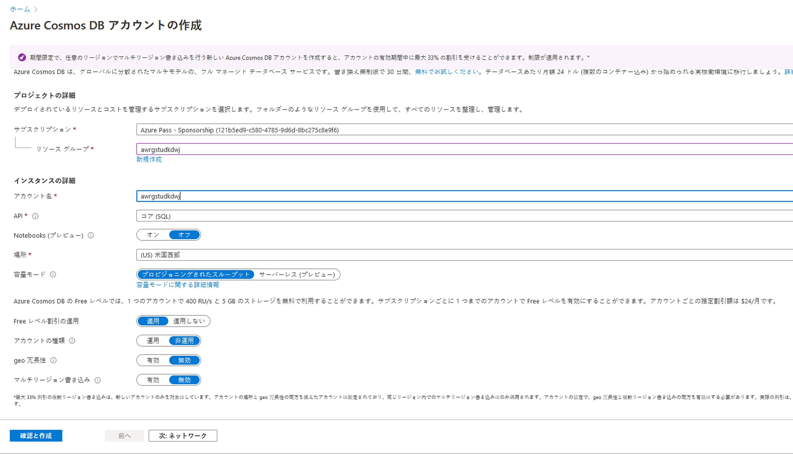

---
lab:
    title: 'Cosmos DB でのグローバル分散データベースの構築'
    module: 'モジュール 4: Azure Cosmos DB によるグローバルに分布されたデータベースの構築'
---

# DP 200 - データ プラットフォーム ソリューションの実装
# ラボ 4 - Cosmos DB を使用したグローバルな分散データベースの構築

**所要時間**: 60 分

**前提条件**: このラボのケース スタディは既に確認していることを前提としています。モジュール 1 のAzure for the Data Engineer のコースとラボも完了済みであることを前提としています。

**ラボ ファイル**: このラボのファイルは、 _Allfiles\Labfiles\Starter\DP-200.4_ のフォルダーにあります。

## ラボの概要

受講者は、Azure Cosmos DB が組織にもたらす機能について説明し、デモンストレーションすることができるようになります。Cosmos DB インスタンスを作成し、ポータルと .Net アプリケーションを介してデータをアップロードおよびクエリする方法を示します。その後、Cosmos DB データベースのグローバル スケールを有効にする方法をデモンストレーションできるようになります。

## ラボの目的
  
このラボを完了すると、次のことができるようになります。

1. スケーリングするために構築された Azure Cosmos DB データベースを作成する
1. Azure Cosmos DB データベースにデータを挿入してクエリを実行する
1. Azure Cosmos DB を使用してデータをグローバルに分散する

## シナリオ
  
AdventureWorks の開発者および情報サービス部門は、Azure で最近リリースされた Cosmos DB と呼ばれる新サービスが、ほぼリアルタイムでデータへのプラネタリー規模のアクセスを提供できることを認識しています。彼らは、サービスの提供する機能と、それが AdventureWorks にもたらす価値、およびその際の状況を理解したいと考えています。

インフォメーション サービス部門は、サービスのセットアップ方法とデータのアップロード方法を理解したいと考えています。開発者は、Cosmos にデータをアップロードするために使用できるアプリケーションの例を知りたいと考えています。どちらも、世界的規模の要求がどのように満たされるのかを理解したいと考えています。

このラボの最後には、次ができるようになります。

1. スケーリングするようにビルドされた Azure Cosmos DB データベースを作成する
1. Azure Cosmos DB データベースにデータを挿入し、クエリを実行する
1. Azure Cosmos DB を使用してデータをグローバルに分散させる

> **重要**: このラボを進めるにつれ、プロビジョニングまたは構成タスクで発生したすべての問題を書き留め、 _\Labfiles\DP-200-Issues-Docx_ にあるドキュメントの表に記録してください。ラボ番号を文書化し、テクノロジーを書き留め、問題とその解決を説明してください。このドキュメントは、後のモジュールで参照できるように保存します。

## 演習 1: スケーリングするために構築された Azure Cosmos DB データベースを作成する

所要時間: 10 分

個別演習
  
この演習の主なタスク:

1. Azure Cosmos DB インスタンスを作成する

### タスク 1: Azure Cosmos DB インスタンスを作成する

1. Azure portal で、必要に応じ、「**ホーム**」ハイパーリンクをクリックします。 

1. 「**+ リソースの作成**」アイコンに移動します。

1. 「新規」画面で、「**マーケットプレースを検索**」テキスト ボックスに移動し、「**Cosmos**」と入力します。表示される一覧の「**Azure Cosmos DB**」をクリックします。

1. 「**Azure Cosmos DB**」画面で、「**作成**」をクリックします。

1. 「**Azure Cosmos DB アカウントの作成**」画面から、次の設定を使用して Azure Cosmos DB アカウントを作成します。

    - 「プロジェクトの詳細」画面で、次の情報を入力します。
    
        - **サブスクリプション**: このラボで使用するサブスクリプションの名前

        - **リソース グループ**: **awrgstudxx** (**xx** は自分のイニシャル)

    - 画面のインスタンスの詳細で、次の情報を入力します。

        - **アカウント名**: **awcdbstudxx** (**xx** は自分のイニシャル)

        - **API**: **Core(SQL)**

        - **Notebooks (プレビュー)**: **オフ**

        - **場所**: ラボの場所に最も近い Azure リージョンの名前と、Azure VM をプロビジョニングできる場所。

        - 残りのオプションは既定値のままにしておきます

            

1. 「**Azure Cosmos DB アカウントの作成**」ブレードで、「**Review + create**」 (確認と作成) をクリックします。

1. 「**Azure Cosmos DB アカウントの作成**」ブレードを検証してから、「**作成**」をクリックします。

   > **注**: プロビジョニングの所要時間は約 5 分です。これらの演習では、Azure でサービスをプロビジョニングする際の追加のタブの説明は省略されています。プロビジョニング画面には、「ネットワーク」、「タグ」、「詳細」などの追加のタブが表示されることがあります。これにより、サービスに対してカスタマイズした設定を定義できます。たとえば、多くのサービスの「ネットワーク」タブを使用すると、仮想ネットワークの構成を定義できるため、特定のデータ サービスに対してネットワーク トラフィックを制御および保護することができます。「タグ」オプションは名前と値のペアになっており、複数のリソースおよびリソース グループに同じタグを適用して、リソースを分類し、一括請求を表示することができます。「詳細」タブは、タブのあるサービスによって異なります。ただし、これらの領域を制御し、ネットワーク管理者や財務部門と協力したり、これらのオプションの構成方法を確認したりする必要がある点に注意することが重要です。

1. プロビジョニングが完了すると、「デプロイが完了しました」という画面が表示されます。「**リソースに移動**」をクリックして次の演習に進みます。 

>**結果**この演習では、Azure Cosmos DB アカウントのプロビジョニングを実行しました。

## 演習 2: Azure Cosmos DB データベースにデータを挿入してクエリを実行する
  
所要時間: 20 分

個別演習
  
この演習の主なタスク:

1. Azure Cosmos DB データベースとコンテナーをセットアップする 

1. ポータルを使用してデータを追加する

1. Azure portal でクエリを実行する

1. データ上で複雑な操作を実行する

### タスク 1: Azure Cosmos DB コンテナーとデータベースをセットアップする

1. Azure portal で、Cosmos DB のデプロイが完了しましたというメッセージが表示されたら、「**Go to resources**」 (リソースに移動) をクリックします。

1. Cosmos DB 画面で、「**概要**」リンクをクリックします。

1. **awcdbstudxx** 画面で、**+ コンテナーの追加** をクリックします。これにより、「**コンテナーの追加**」ブレードで、「**awcdbstudxx データ エクスプローラー**」画面を開きます。

1. 「**コレクションの追加**」ブレードで、次の設定で「衣料品」という名前のコレクションを含む製品データベースを作成します。

    - **データベース ID**: **製品**
    
    - **スループット**:  **400**

    - **コンテナー ID**:  **衣料品**

    - **パーティション キー**: **/productId**

    - 残りのオプションは既定値のままにしておきます

        

1. 「**コンテナーの追加**」画面で、「**OK**」をクリックします。

### タスク 2: ポータルを使用してデータを追加する

1. 「**awcdbstudcto - データ エクスプローラー**」画面で、データ エクスプローラー ツールバーの「新規コレクション」ボタンの反対側で、「**全画面表示**」ボタンをクリックします。「全画面表示」ダイアログ ボックスで、「**開く**」をクリックします。Microsoft Edge で新しいタブが開きます。

1. 「**SQL API**」ペインで、更新アイコンをクリックし、「**Products**」 (製品) を展開し、「**Clothing**」 (洋服) をクリックして「**アイテム**」をクリックします。 

1. ドキュメント ペインで、**新規アイテム** のアイコンをクリックします。新しいドキュメントが表示され、置き換えるサンプル JSON が表示されます。

1. 次のコードをコピーし、「**ドキュメント**」タブに貼り付けます。

    ```JSON
    {
       "id": "1",
       "productId": "33218896",
       "category": "Women's Clothing",
       "manufacturer": "Contoso Sport",
       "description": "Quick dry crew neck t-shirt",
       "price": "14.99",
       "shipping": {
           "weight": 1,
           "dimensions": {
           "width": 6,
           "height": 8,
           "depth": 1
          }
       }
    }
    ```

    

1. 「ドキュメント」タブに JSON を追加したら、「**保存**」をクリックします。

1. ドキュメント ペインで、**新規アイテム** のアイコンをクリックします。

1. 次のコードをコピーし、**アイテム** タブに貼り付けます。

    ```JSON
    {
        "id": "2",
        "productId": "33218897",
        "category": "Women's Outerwear",
        "manufacturer": "Contoso",
        "description": "Black wool pea-coat",
        "price": "49.99",
        "shipping": {
            "weight": 2,
            "dimensions": {
            "width": 8,
            "height": 11,
            "depth": 3
            }
        }
    }
    ```

    

1. 「ドキュメント」タブに JSON を追加したら、「**保存**」をクリックします。

1. 左側のメニューで各ドキュメントをクリックすると、保存された各ドキュメントを表示することができます。ID が 1 である最初のアイテムの値は、**33218896** (productId の名前)、2番目のアイテムは **33218897** となります

### タスク 3: Azure portal でクエリを実行する。

1. Azure portal の「**items**」 (項目) 画面で、「**更新**」アイコンの上にある「**SQL API**」ブレード上の「**New SQL Query**」 (新規 SQL クエリ) ボタンをクリックします。

    > **注**: クエリ 1 画面が表示され、クエリ **SELECT * FROM c** が表示されます。

1. productId 1 の詳細を示す JSON ファイルを返すクエリを置き換えます。

    ```SQL
    SELECT *
    FROM Products p
    WHERE p.id ="1"
    ```

1. 「**Execute Query**」 (クエリの実行) アイコンをクリックします。次の結果が返されます

    ```JSON
    [
        {
            "id": "1",
            "productId": "33218896",
            "category": "Women's Clothing",
            "manufacturer": "Contoso Sport",
            "description": "Quick dry crew neck t-shirt",
            "price": "14.99",
            "shipping": {
                "weight": 1,
                "dimensions": {
                    "width": 6,
                    "height": 8,
                    "depth": 1
                }
            },
            "_rid": "I2YsALxG+-EBAAAAAAAAAA==",
            "_self": "dbs/I2YsAA==/colls/I2YsALxG+-E=/docs/I2YsALxG+-EBAAAAAAAAAA==/",
            "_etag": "\"0000844e-0000-1a00-0000-5ca79f840000\"",
            "_attachments": "attachments/",
            "_ts": 1554489220
        }
    ]
    ```

    

1. 既存のクエリ ウィンドウ。productId の JSON ファイルに ID、製造元、および説明を返すクエリを記述する 

    ```SQL
    SELECT
        p.id,
        p.manufacturer,
        p.description
    FROM Products p
    WHERE p.id ="1"
    ```

1. 「**Execute Query**」 (クエリの実行) アイコンをクリックします。次の結果が返されます

    ```JSON
    [
    {
        "id": "1",
        "manufacturer": "Contoso Sport",
        "description": "Quick dry crew neck t-shirt"
    }
    ]
    ```

    

1. 既存のクエリ ウィンドウで、価格順に並べ替えられたすべての製品の価格、説明、および製品 ID を昇順に返すクエリを記述します。

    ```SQL
    SELECT p.price, p.description, p.productId
    FROM Products p
    ORDER BY p.price ASC
    ```

1. 「**Execute Query**」 (クエリの実行) アイコンをクリックします。次の結果が返されます

    ```JSON
    [
        {
            "price": "14.99",
            "description": "Quick dry crew neck t-shirt",
            "productId": "33218896"
        },
        {
            "price": "49.99",
            "description": "Black wool pea-coat",
            "productId": "33218897"
        }
    ]
    ```

    

### タスク 4: データ上で複雑な操作を実行する

1. Azure portal の「**アイテム**」画面で、「**新規ストアド プロシージャ**」ボタンをクリックします。

    > **注**: サンプルのストアド プロシージャを示す新しいストアド プロシージャ画面が表示されます。

1. 「新規ストアド プロシージャ」画面で、「**ストアド プロシージャ ID**」テキスト ボックスに「**createMyDocument**」と入力します。

1. 次のコードを使用して、ストアド プロシージャ本体にストアド プロシージャを作成します。

    ```Javascript
    function createMyDocument() {
        var context = getContext();
        var collection = context.getCollection();

        var doc = {
            "id": "3",
            "productId": "33218898",
            "description": "Contoso microfleece zip-up jacket",
            "price": "44.99"
        };

        var accepted = collection.createDocument(collection.getSelfLink(),
            doc,
            function (err, documentCreated) {
                if (err) throw new Error('Error' + err.message);
                context.getResponse().setBody(documentCreated)
            });
        if (!accepted) return;
    }
    ```

1. 「新規ストアド プロシージャ」画面で、「**保存**」をクリックします。

1. 「新規ストアド プロシージャ」画面で、「**実行**」をクリックします。

1. 「入力パラメータ」画面で、「**タイプ**」を「**文字列**」に設定し、「**パーティションキー値**」テキストボックスで、**値**を「**33218898**」に設定してから、「**実行**」をクリックする必要があります。

次の結果が返されます

    ```JSON
    {
        "id": "3",
        "productId": "33218898",
        "description": "Contoso microfleece zip-up jacket",
        "price": "44.99",
        "_rid": "I2YsALxG+-EDAAAAAAAAAA==",
        "_self": "dbs/I2YsAA==/colls/I2YsALxG+-E=/docs/I2YsALxG+-EDAAAAAAAAAA==/",
        "_etag": "\"0000874e-0000-1a00-0000-5ca7a7050000\"",
        "_attachments": "attachments/"
    }
    ```

1. Azure portal のデータ エクスプローラーの全画面表示で、ドロップダウン ボタンで「**新しいストアド プロシージャ**」をクリックし、「**New UDF**」 (New UDF) をクリックします。

    > **注**: **function userDefinedFunction(){}** を示す新しい UDF 1 画面が表示されます。

1. 「New Defined Function」 (新しく定義された関数) 画面の「**User Defined Function Id**」 (ユーザー定義関数 ID) テキスト ボックスに、「**producttax**」と入力します。

1. 次のコードを使用して、ユーザー定義関数本体内にユーザー定義関数を作成します。

    ```Javascript
    function producttax(price) {
        if (price == undefined) 
            throw 'no input';

        var amount = parseFloat(price);

        if (amount < 1000) 
            return amount * 0.1;
        else if (amount < 10000) 
            return amount * 0.2;
        else
            return amount * 0.4;
    }
    ```

1. 「新規 UDF 1」画面で、「**保存**」をクリックします。

1. 「クエリ 1」タブをクリックし、既存のクエリを次のクエリに置き換えます。

    ```SQL
    SELECT c.id, c.productId, c.price, udf.producttax(c.price) AS producttax FROM c
    ```

1. 「クエリ 1」画面で、「**Execute Query**」 (クエリの実行) をクリックします。

次の結果が返されます

    ```JSON
    [
        {
            "id": "1",
            "productId": "33218896",
            "price": "14.99",
            "producttax": 1.499
        },
        {
            "id": "2",
            "productId": "33218897",
            "price": "49.99",
            "producttax": 4.9990000000000005
        },
        {
            "id": "3",
            "productId": "33218898",
            "price": "44.99",
            "producttax": 4.4990000000000005
        }
    ]
    ```

## 演習 3: Azure Cosmos DB を使用してデータをグローバルに分散する

所要時間: 15 分

個別演習

この演習の主なタスク:

1. データを複数のリージョンに複製する

1. フェールオーバーの管理

### タスク 1: データを複数のリージョンに複製する

1. Microsoft Edge で、「**awcdbstudxx - Data Explorer..**」と表示されたタブをクリックします。

1. 「接続エラー」のメッセージが表示されたら、「**更新**」ボタンをクリックします。

1. 「**awcdbstudxx - Data Explorer**」ウィンドウで、「**データをグローバルにレプリケートする**」をクリックします。

    

1. 世界地図上で、自分が居住する大陸のデータ センターの場所をシングル クリックし、「**保存**」をクリックします。

>**注**追加のデータ センターのプロビジョニングには約 7 分かかります。

### タスク 2: フェールオーバーの管理。

1. 「**awcdbstudxx - データをグローバルに複製**」ウィンドウで、「**手動フェールオーバー**」をクリックします。

1. 「**読み取りリージョン**」データセンターの場所をクリックし、「現在の書き込みリージョンに対してフェールオーバーをトリガーすることを理解したうえで同意します。」の横にあるチェック ボックスをオンにし、「**OK**」をクリックします。

>**注**手動フェールオーバーには約 3 分かかります。画面は次のようになります。アイコンの色が変わったことに注意してください


1. 「**awcdbstudxx - データをグローバルに複製**」ウィンドウで、「**自動フェールオーバー**」をクリックします。

1. 「自動フェールオーバー」画面で、「**オン**」ボタンをクリックし、「**OK**」をクリックします。

>**注**自動フェールオーバーのプロビジョニングには約 3 分かかります。


