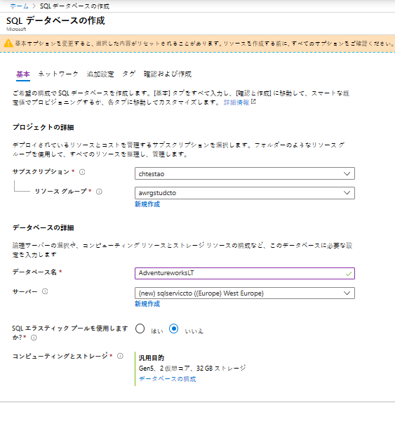
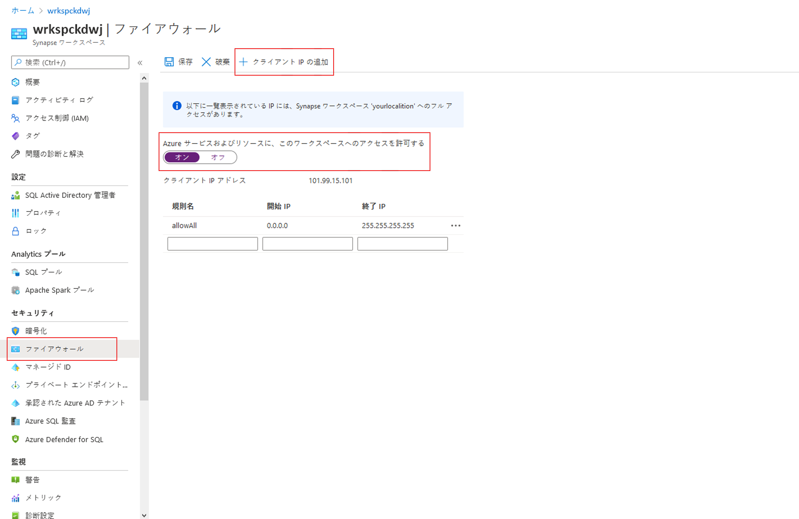

---
lab:
    title: 'クラウドでのリレーショナル データ ストアの操作'
    module: 'モジュール 5: クラウドで関係データを扱う'
---

# DP 200 - データ プラットフォーム ソリューションの実装
# ラボ 5 - クラウドでのリレーショナル データ ストアの操作

**所要時間**: 75 分

**前提条件**: このラボのケース スタディは既に確認していることを前提としています。モジュール 1 の内容と課題は次のことを前提としています。データ エンジニア向け Azure も完了済みであること

**ラボ ファイル**: この課題のファイルは、_Allfiles\Labfiles\Starter\DP-200.5_ のフォルダーにあります。

## ラボの概要

学生は、Azure SQL データベースと Azure Synapse Analytics サーバーをプロビジョニングし、作成されたインスタンスの 1 つに対してクエリを発行できます。また、SQL Data Warehouse をその他複数のデータ プラットフォーム テクノロジーと統合し、PolyBase を使用して 1 つのデータ ソースから Azure Synapse Analytics にデータを読み込むこともできます。

## 課題の目的
  
このラボを完了すると、次のことができるようになります。

1. Azure SQL データベースを使用する
1. Azure Synapse Analytics について説明する 
1. Azure Synapse Analytics を作成してクエリを実行する 
1. PolyBase を使用して Azure Synapse Analytics にデータを読み込む 

## シナリオ
  
ユーザーは AdventureWorks のシニア データ エンジニアであり、チームと協力して、オンプレミスの SQL Server から Azure にある Azure SQL データベースにリレーショナル データベース システムを移行します。まず、会社のサンプル データベースを使用して Azure SQL データベースのインスタンスを作成します。あなたは、このインスタンスをジュニア データ エンジニアに渡して、部門データベースのテストを実行することを目的とします。

次に、SQL Synapse Analytics サーバーをプロビジョニングし、一連のクエリを使用してサンプル データベースをテストすることで、サーバーのプロビジョニングが成功したことをテストします。次に、このデータ プラットフォーム テクノロジと Azure Synapse Analytics が統合したことをテストするために、PolyBase を使用して Azure BLOB からディメンション テーブルを読み込みます。

このラボを完了すると:

1. Azure SQL データベースを使用した
1. Azure Synapse Analytics について説明した 
1. Azure Synapse Analytics を作成してクエリを実行しました 
1. PolyBase を使用して Azure Synapse Analytics にデータを読み込んだ 

> **重要**: このラボを進めるにつれ、プロビジョニングまたは構成タスクで発生した問題を書き留め、_\Labfiles\DP-200-Issues-Docx_にあるドキュメントの表に記録してください。ラボ番号を文書化し、テクノロジーを書き留め、問題とその解決を説明してください。このドキュメントは、後のモジュールで参照できるように保存します。

## エクササイズ 1: Azure SQL データベースを使用する

所要時間: 15 分

個別エクササイズ
  
このエクササイズの主なタスク:

1. SQL データベース インスタンスを作成して構成する。

### タスク 1: SQL データベース インスタンスを作成して構成する。

1. Azure portal で、[**+ リソースを作成する**] ブレードに移動します。

1. [新規] スクリーンで、[**マーケット プレースの検索**] テキスト ボックスをクリックし、「**SQL Database**」という単語を入力します。表示される一覧で [**SQL Database**] をクリックします。

1. [**SQL Database**] 画面で、[**作成**] をクリックします。

1. [**SQL Database の作成**] 画面から、次の設定を使用して Azure SQL データベースを作成します。

    - [プロジェクトの詳細] セクションで、次の情報を入力します
    
        - **Subscription**: このラボで使用するサブスクリプションの名前

        - **リソース グループ**: **awrgstudxx** (**xx** は自分のイニシャル)。

    - [**追加設定**] タブをクリックし、[**サンプル**] をクリックします。AdventureworksLT サンプル データベースが自動的に選択されます。 
    
    - これが完了したら、[**基本**] タブをクリックします。
    
    - [データベースの詳細] セクションで、次の情報を入力する
    
        - データベース名: 「**AdventureworksLT**」と入力します。
     
        - サーバー: 次の設定で [**新規作成**] をクリックして新しいサーバーを作成し、[**OK**] をクリックします。
            - **サーバー名**: **sqlservicexx** (**xx** は自分のイニシャル)
            - **サーバー管理者のログイン**: **xxsqladmin** (**xx** は自分のイニシャル)
            - **パスワード**: **Pa55w.rd**
            - **パスワードを確認**: **Pa55w.rd**
            - **場所**: 近くの **場所** を選択します。
            - [**OK**] をクリックします。

                

            - その他の設定は既定のままにして、[**OK**] をクリックします。
            

    

1. [**SQL Database の作成**] ブレードで、[**確認および作成**] をクリックします。

1. [**SQL Database の作成**] ブレードの検証後、[**作成**] をクリックします。

   > **注記**: プロビジョニングの所要時間は約 4 分です。

> **結果**: このエクササイズを完了すると、Azure SQL データベース インスタンスが作成されます。

## エクササイズ 2: Azure Synapse Analytics について説明する
  
所要時間: 15 分

個別エクササイズ
  
このエクササイズの主なタスク:

1. Azure Synapse Analytics インスタンスを作成して構成する。

1. サーバー ファイアウォールを構成する

1. ウェアハウス データベースを一時停止する

### タスク 1: Azure Synapse Analytics インスタンスを作成して構成する。

1. Azure portal で、画面の左上にあるリンク [**ホーム**] をクリックします。 

2. Azure portal で、[**+ リソースの作成**] をクリックします。

3. [新規] ブレードで、[**マーケット プレースの検索**] テキスト ボックスに移動し、「**Synapse**」という単語を入力します。表示される一覧の [**Azure Synapse Analytics**] をクリックします。

4. [**Azure Synapse Analytics**] ブレードで [**作成**] をクリックします。

5. **Synapse ワークスペースの作成** **基本**ブレードから、以下の設定でAzure Synapse Analytics ワークスペースを作成します:

    - プロジェクトの詳細セクションで、以下の情報を入力します。

        - **サブスクリプション**: このラボで使用するサブスクリプションの名前。

        - **リソースグループ**: **awrgstudxx** **xx**はあなたのイニシャルです

    - ワークスペースの詳細セクションでは、以下の設定でワークスペースを作成します。
        
        - **ワークスペース名**: **wrkspcxx** **xx** はあなたのイニシャルです。
        - **地域**: 最寄りの地域とリソースグループを配置した場所を選択します。
        - **Data Lake Storage Gen2を選択する**: "サブスクリプションから"
        - **アカウント名**: **awdlsstudxx**を選択してください。, **xx**はあなたのイニシャルです
        - **ファイルシステム名**: **data**を選択してください。
        - Data Lake Storage Gen2 アカウント 'awdlsstudxx' の "ストレージBLOBデータ共同作成者の役割を自分に割り当てる" に**チェック**を入れます。

         

    - **Synapse ワークスペースの作成**ブレードの**セキュリティ**タブに移動します。
    - SQL管理者の資格情報セクションでは、以下の情報を入力します。
        - **パスワード**。**Pa55w.rd**
        - **パスワードの確認** **Pa55w.rd**: **Pa55w.rd**: **Pa55w.rd
        - その他の設定はすべて defaultのままにしておきます。


    - 画面で、**確認および作成**をクリックします。
    - ブレードで、**作成**をクリックします。
    
   > **Note**: 約7分かかります。

6. プロビジョニングが完了したら、**リソースに移動**を選択すると、Azure Synapse Analytics ワークスペースの**概要**ページに着地します。 

7. 新しい専用SQLプール**を選択します。

8.. 専用SQLプールの作成**ブレードの**基本**ページで、以下の設定を構成します。
        - 専用SQLプール名: **dedsqlxx**, **xx**はイニシャルです。
        - 他のすべての設定はデフォルトのままにしておく

9. **専用SQLプールの作成**画面で、**確認および作成**をクリックします。

10. **専用SQLプール**の作成**ブレードで、**作成**をクリックします。
  

   > **Note**: 約7分かかります。


### タスク 2: サーバー ファイアウォールを構成する

1. Azure portal 内のブレードで、[**Resource groups**] (リソース グループ)、[**awrgstudxx**] をクリックします (**xx** は自分のイニシャル)。

1. [**wrkspcxx**] (**xx** は自分のイニシャル) をクリックします。

1. [**wrkspcxx**] 画面で、[**ファイアウォール**] をクリックします。

1. [wrkspcxx - ファイアウォール] 画面で、オプション [**+ クライアント IP の追加**] をクリックし、[**保存**] をクリックします。成功画面で、[**OK**] をクリックします。

    

    > **注**: サーバーのファイアウォール規則が正常に更新されたことを示すメッセージを受け取ります。

1. ファイアウォールと仮想ネットワークの画面を閉じます。

> [**結果**]: このエクササイズを完了すると、Azure Synapse Analytics インスタンスを作成し、サーバー ファイアウォールを構成して、それに対する接続を有効にします。

### タスク 3: Warehousexx データベースを一時停止する

1. [**Warehousexx**] (**xx** は自分のイニシャル) をクリックします。

1. [**Warehousexx (dwhservicexx/Warehousexx)**] 画面で、[**一時停止**] をクリックします。

1. [Warehousexx の一時停止] 画面で、[**はい**] をクリックします。


## エクササイズ 3: Azure Synapse Analytics データベースとテーブルの作成

所要時間: 25 分

個別エクササイズ

このエクササイズの主なタスクは次のとおりです。

1. SQL Server Management Studio をインストールし、Data Warehouse インスタンスに接続する。

1. SQL Data Warehouse データベースを作成する

1. SQL Data Warehouse テーブルを作成する

    > **注記**: Transact-SQL に慣れていない場合は、次の課題のステートメントは、次の場所「**Allfiles\Labfiles\Starter\DP-200.5\SQL DW Files**」にあるものを使用することができます。

### タスク 1: SQL Server Management Studio をインストールし、SQL Data Warehouse インスタンスに接続する。

1. Azure portal の [**dwhservicexx - ファイアウォールと仮想ネットワーク**] ブレードで [**プロパティ**] をクリックします。

1. [**"サーバー名"**] をコピーしてメモ帳に貼り付けます。

1. [SQL Server Management Studio](https://docs.microsoft.com/ja-jp/sql/ssms/download-sql-server-management-studio-ssms?view=sql-server-2017) をダウンロードし、コンピューターにインストールします

1. Windows デスクトップで [**スタート**] をクリックし、「**”SQL Server”**」と入力し、[**Microsoft SQL Server Management Studio 17**] をクリックします。

1. [**サーバーに接続**] ダイアログ ボックスで、次の詳細情報を入力します。
    - サーバー名: **dwhservicexx.database.windows.net**
    - 認証: **SQL Server の認証**
    - ユーザー名: **xxsqladmin**
    - パスワード: **Pa55w.rd**

1. [**Connect to Server**] (サーバーに接続) ダイアログ ボックスで、[**Connect**] (接続) をクリックします。 

### タスク 2：SQL Data Warehouse データベースを作成します。

1. **SQL Server Management Studio** の Object Explorer で、[**dwhservicexx.database.windows.net**] を右クリックし、[**新しいクエリ**] をクリックします。 

1. クエリ ウィンドウで、サービス目標を DW100、最大サイズ 1024 GB で、**DWDB** という名前の DataWarehouse データベースを作成します。

    ```SQL
    CREATE DATABASE DWDB COLLATE SQL_Latin1_General_CP1_CI_AS
    (
        EDITION             = 'DataWarehouse'
    ,   SERVICE_OBJECTIVE   = 'DW100C'
    ,   MAXSIZE             = 1024 GB
    );
    ```

    > **注**: データベースの作成には約 2 分かかります。


### タスク 3: SQL Data Warehouse テーブルを作成する。

1. **SQL Server Management Studio** の Object Explorer で、[**dwhservicexx.database.windows.net**] を右クリックし、[**新しいクエリ**] をクリックします。

1. [**SQL Server Management Studio**] の SQL エディター ツールバーの [**利用可能なデータベース**] で、[**DWDB**] をクリックします。

    >**注**: Transact-SQL に慣れていない場合は、「**Exercise3 Task3Step2 script.sql**」という名前の Allfiles\Solution\DP-200.5\folder にスクリプトがあります。テーブルの作成に必要なコードの大部分が含まれていますが、各テーブルに使用する配分タイプを選択してコードを完成させる必要があります 

1. 次の列に **replicate** の分散を持つ [**クラスター化された columnstore**] インデックスを有する「**dbo.Users**」という名前のテーブルを作成します。

    | 列名 | データ型 | NULL 値の許容|
    |-------------|-----------|------------|
    | userId | int | NULL|
    | 都市 | nvarchar(100) | NULL|
    | リージョン | nvarchar(100) | NULL 値|
    | 国 | nvarchar(100) | NULL|

1. **SQL Server Management Studio** で、[**実行**] をクリックします。

1. **SQL Server Management Studio** の Object Explorer で、[**dwhservicexx.database.windows.net**] を右クリックし、[**新しいクエリ**] をクリックします。

1. [**SQL Server Management Studio**] の SQL エディター ツールバーの [**利用可能なデータベース**] で、[**DWDB**] をクリックします。

1. 次の列に **round robin** の分散を持つ [**クラスター化された columnstore**] インデックスを有する「**dbo.Products** 」という名前のテーブルを作成します。

    | 列名 | データ型 | NULL 値の許容|
    |-------------|-----------|------------|
    | ProductId | int | NULL|
    | EnglishProductName | nvarchar(100) | NULL|
    | 色 | nvarchar(100) | NULL|
    | StandardCost | int | NULL|
    | ListPrice | int | NULL|
    | サイズ | nvarchar(100) | NULL|
    | 重量 | int | NULL|
    | DaysToManufacture | int | NULL|
    | クラス | nvarchar(100) | NULL|
    | Style (スタイル) | nvarchar(100) | NULL|

1. **SQL Server Management Studio** で、[**実行**] をクリックします。

1. **SQL Server Management Studio** の Object Explorer で、[**dwhservicexx.database.windows.net**] を右クリックし、[**新しいクエリ**] をクリックします。

1. [**SQL Server Management Studio**] の SQL エディター ツールバーの [**利用可能なデータベース**] で、[**DWDB**] をクリックします。

1. 次の列を持つ **SalesUnit** での **ハッシュ** 分散を使用して、**クラスター化列ストア** インデックスを有する **dbo.FactSales** という名前のテーブルを作成します。

    | 列名 | データ型 | NULL 値の許容|
    |-------------|-----------|------------|
    | DateId | int | NULL|
    | ProductId | int | NULL|
    | UserId | int | NULL|
    | UserPreferenceId | int | NULL|
    | SalesUnit | int | NULL|

1. **SQL Server Management Studio** で、[**実行**] をクリックします。

> **結果**: このエクササイズを完了すると、SQL Server Management Studio をインストールして、DWDB という名前のデータ ウェアハウスと、Users、Products、FactSales という名前の 3 つのテーブルが作成されます。

## エクササイズ 4: PolyBase を使用した Azure Synapse Analytics へのデータ読み込み 

所要時間: 10 分

個別エクササイズ

このエクササイズの主なタスク:

1. Data Lake Storage コンテナーとキーの詳細の収集

1. Azure Data Lake Storage の PolyBase を使用して dbo.Dates テーブルを作成する

### タスク 1: Azure BLOB アカウント名とキーの詳細を収集する

1. Azure portal で、[**リソース グループ]**] をクリックしてから、[**awrgstudxx**] をクリックし、次に [**awdlsstudxx**] をクリックします (xx は名前のイニシャル)。

1. [**awdlsstudxx**] 画面で、[**アクセス キー**] をクリックします。[**ストレージ アカウント名**] の横にあるアイコンをクリックし、メモ帳に貼り付けます。

1. [**awsastudxx - アクセス キー**] 画面の [**key1**] で、[**キー**] の横にあるアイコンをクリックし、メモ帳に貼り付けます。

### タスク 2: Azure BLOB から PolyBase を使用し、dbo.Dates テーブルを作成する

1. **SQL Server Management Studio** の Object Explorer で、[**dwhservicexx.database.windows.net**] を右クリックし、[**新しいクエリ**] をクリックします。

1. [**SQL Server Management Studio**] の SQL エディター ツールバーの [**利用可能なデータベース**] で、[**DWDB**] をクリックします。

1. **DWDB** データベースに対して **マスター キー** を作成します。クエリ エディターで、次のコードを入力します。

    ```SQL
    CREATE MASTER KEY;
    ```

1. 次のコードを入力して、次の詳細を含む、「**AzureStorageCredential**」という名前のデータベース スコープの資格情報を作成します。
    - ID: **MOCID**
    - シークレット: **ストレージ アカウントのアクセス キー**

    ```SQL
    CREATE DATABASE SCOPED CREDENTIAL AzureStorageCredential
    WITH
    IDENTITY = 'MOCID',
    SECRET = 'Your storage account key'
;
    ```

1. **SQL Server Management Studio** で、両方のステートメントをハイライトし、[**実行**] をクリックします。

1. **SQL Server Management Studio** のクエリ ウィンドウに、**AzureStorageCredential** を使用する **HADOOP** タイプで作成された BLOB ストレージ アカウントとデータ コンテナー用に「**AzureStorage**」という名前の外部データ ソースを作成するコードを入力します。場所キーの **awdlsstudxx** を自分のストレージ アカウントで自分のイニシャルに置き換える必要があります。 

    ```SQL
	CREATE EXTERNAL DATA SOURCE AzureStorage
    WITH (
        TYPE = HADOOP,
        LOCATION = 'abfs://data@awdlsstudxx.dfs.core.windows.net',
        CREDENTIAL = AzureStorageCredential
    );
    ```

1. **SQL Server Management Studio** のクエリ ウィンドウに、formattype が **DelimitedText**、フィールド ターミネータが **コンマ** の「**TextFile**」という名前の外部ファイル形式を作成するコードを入力します。

    ```SQL
    CREATE EXTERNAL FILE FORMAT TextFile
    WITH (
        FORMAT_TYPE = DelimitedText,
        FORMAT_OPTIONS (FIELD_TERMINATOR = ',')
    );
    ```

1. **SQL Server Management Studio** で、ステートメントをハイライトし、[**実行**] をクリック します。

1. **SQL Server Management Studio** のクエリ ウィンドウに、ルート ファイルとして「**場所**」、データ ソースとして「**AzureStorage**」、次の列を持つ「**TextFile**」のFile_format で、「**dbo.DimDate2External**」という名前の外部テーブルを作成するコードを入力します。

    | 列名 | データ型 | NULL 値の許容|
    |-------------|-----------|------------|
    | 日付 | datetime2(3) | NULL|
    | DateKey | decimal(38, 0) | NULL|
    | MonthKey | decimal(38, 0) | NULL|
    | 月 | nvarchar(100) | NULL|
    | 四半期 | nvarchar(100) | NULL|
    | Year | decimal(38, 0) | NULL|
    | Year-Quarter | nvarchar(100) | NULL|
    | Year-Month | nvarchar(100) | NULL|
    | Year-MonthKey | nvarchar(100) | NULL|
    | WeekDayKey| decimal(38, 0) | NULL|
    | WeekDay| nvarchar(100) | NULL|
    | Day Of Month| decimal(38, 0) | NULL|

    ```SQL
	CREATE EXTERNAL TABLE dbo.DimDate2External (
    [Date] datetime2(3) NULL,
    [DateKey] decimal(38, 0) NULL,
    [MonthKey] decimal(38, 0) NULL,
    [Month] nvarchar(100) NULL,
    [Quarter] nvarchar(100) NULL,
    [Year] decimal(38, 0) NULL,
    [Year-Quarter] nvarchar(100) NULL,
    [Year-Month] nvarchar(100) NULL,
    [Year-MonthKey] nvarchar(100) NULL,
    [WeekDayKey] decimal(38, 0) NULL,
    [WeekDay] nvarchar(100) NULL,
    [Day Of Month] decimal(38, 0) NULL
    )
    WITH (
        LOCATION='/DimDate2.txt',
        DATA_SOURCE=AzureStorage,
        FILE_FORMAT=TextFile
    );
    ```

1. **SQL Server Management Studio** で、ステートメントをハイライトし、[**実行**] をクリック します。

1. テーブルに対して select ステートメントを実行して、テーブルが作成されたことをテストします。

    ```SQL
    SELECT * FROM dbo.DimDate2External;
    ```

1. **SQL Server Management Studio** のクエリ ウィンドウに、**columnstore** インデックス、および **dbo.DimDate2External** テーブルからデータを読み込む **ラウンド ロビン** の **分散** を含む、「**dbo.Dates**」という名前のテーブルを作成する **CTAS** ステートメントを入力します。

    ```SQL
    CREATE TABLE dbo.Dates
    WITH
    (   
        CLUSTERED COLUMNSTORE INDEX,
        DISTRIBUTION = ROUND_ROBIN
    )
    AS
    SELECT * FROM [dbo].[DimDate2External];
    ```

1. **SQL Server Management Studio** で、ステートメントをハイライトし、[**実行**] をクリック します。
 
1. **SQL Server Management Studio** のクエリ ウィンドウに、**DateKey**、**Quarter**、**Month** 列の統計を作成するクエリを入力します。

    ```SQL
    CREATE STATISTICS [DateKey] on [Dates] ([DateKey]);
    CREATE STATISTICS [Quarter] on [Dates] ([Quarter]);
    CREATE STATISTICS [Month] on [Dates] ([Month]);
    ```

1. テーブルに対して select ステートメントを実行して、テーブルが作成されたことをテストします。

    ```SQL
    SELECT * FROM dbo.Dates;
    ```


