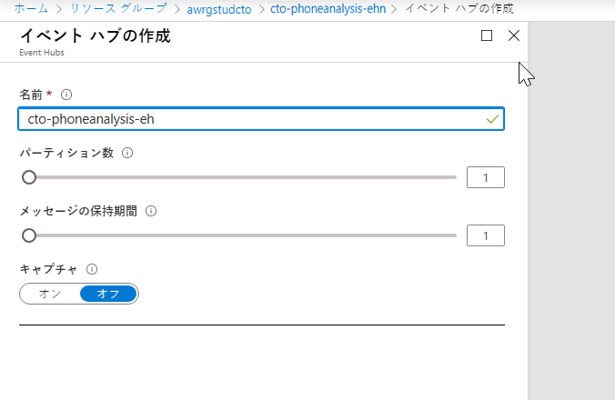
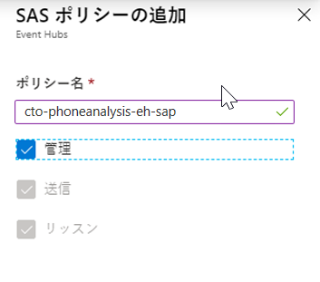
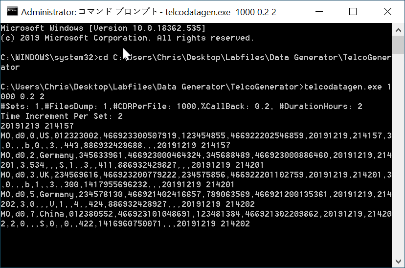
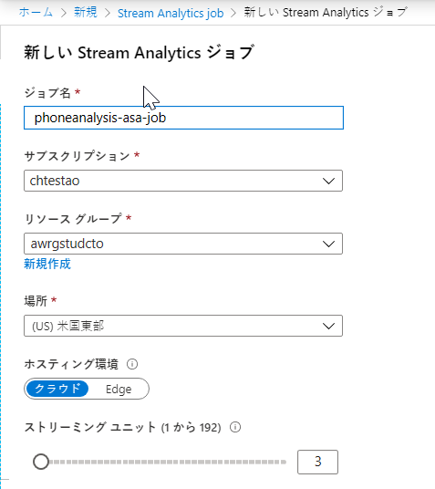
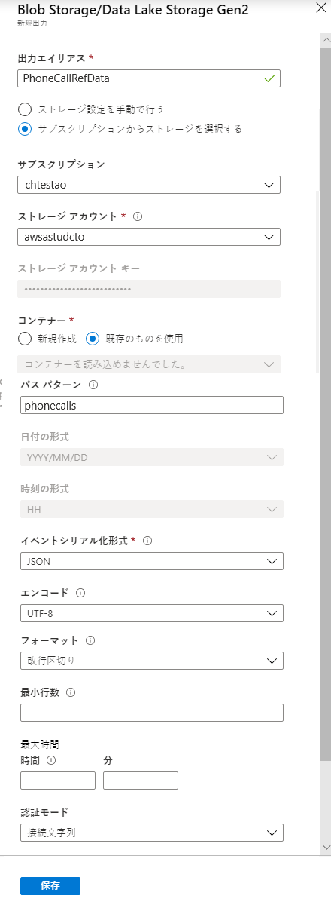

# DP 200 - データ プラットフォーム ソリューションの実装
# ラボ 6 - Stream Analytics を使用したリアルタイム分析の実行

**予想時間**: 60 分

**前提条件**: この課題のケース スタディは既に確認していることを前提としています。モジュール 1 のコンテンツとラボは次のとおりです：データ エンジニア向け Azure も完了済みであること

**ラボ ファイル**: この課題のファイルは、_Allfiles\Labfiles\Starter\DP-200.6_ フォルダーにあります。

## ラボの概要

学生は、データ ストリームとは何か、またイベント処理がどう行われるかを説明し、AdventureWorks のケース スタディに適したデータ ストリーム インジェスト技術を選択できるようになります。選択したインジェスト テクノロジーをプロビジョニングし、これを Stream Analytics と統合して、ストリーミング データで動作するソリューションを作成します。

## 課題の目的
  
この課題を完了すると、次のことができるようになります。

1. データ ストリームとイベント処理の説明
2. Event Hubs でのデータ インジェスト
3. データ生成アプリケーションを開始する
4. Stream Analytics ジョブでのデータの処理

## シナリオ
  
デジタル革新プロジェクトの一環として、カスタマー サービス部門が不正な電話を特定するのを支援するために、あなたは CIO によって任命されました。ここ数年、カスタマーサービス部門は、保証対象ではない自転車や AdventureWorks で購入していない自転車のサポートを求めている詐欺的な顧客からの電話の増加を観察しました。 

同部門では現在、この情報を特定するために顧客サービス エージェントの対応に依存しています。その結果、彼らはエージェントがリアルタイムで誰が不正な要求をする可能性があるのかを追跡するシステムを実装したいと思います。

このラボを完了すると:

1. データ ストリームとイベント処理を説明した
2. Event Hubs を使用して取り込まれたデータ
3. データ生成アプリケーションを開始した
4. Stream Analytics ジョブを使用してデータを処理した

> **重要**: このラボを進めるにつれ、プロビジョニングまたは構成タスクで発生した問題を書き留め、_\Labfiles\DP-200-Issues-Docx_にあるドキュメントの表に記録してください。課題番号を文書化し、テクノロジを記述し、問題とその解決を説明します。このドキュメントは、後のモジュールで参照できるように保存します。

## 演習 1: データ ストリームとイベント処理の説明 

推定時間: 15 分

グループ エクササイズ
  
このエクササイズの主なタスクは、以下の通りです。

1. ケース スタディとシナリオから、AdventureWorks のデータ ストリーム インジェスト技術と、データ エンジニアとして実行する高レベルのタスクを特定して、ソーシャル メディア分析の要件を完了します。

2. インストラクターは、検出結果についてグループと話し合います。

### タスク 1: AdventureWorks のデータ要件と構造を特定する。

1. 課題の仮想マシンから **Microsoft Word** を起動し、**Allfiles\Labfiles\Starter\DP-200.6** フォルダーからファイル **DP-200-Lab06-Ex01.docx** を開きます。

2. グループの場合は、グループがケース スタディ ドキュメント内で識別したデータ要件とデータ構造についての議論とリスト作成に、**10 分** 時間をかけます。

### タスク 2: 検出結果についてインストラクターと話し合う

1. インストラクターは、検出結果について話し合うためにグループを中断させます。

> **結果**: このエクササイズを完了すると、データ ストリーミング インジェスト の結果としてのテーブルと、ソーシャル メディア分析要件を完了するためにデータ エンジニアとして指揮すべきハイレベルなタスクをまとめた Microsoft Word ドキュメントが完成します。

## 演習 2: Event Hubs を使用したデータ インジェスト
  
推定時間: 15 分

個別エクササイズ
  
このエクササイズの主なタスクは次のとおりです。

1. イベント ハブ名前空間を作成して構成する。

2. イベント ハブを作成、構成します。

3. イベント ハブ のセキュリティを構成する。

### タスク 1: イベント ハブ名前空間を作成して構成する。

1. Azure portal で、画面左上の 「**ホーム**」 ハイパーリンクをクリックします。

2. Azure portal で、**リソースを作成** アイコンをクリックし、「**Event Hubs**」 と入力し、検索結果から **Event Hubs** を選択します。Event Hubs 画面で 「**作成**」 をクリックします。

3. 「名前空間の作成」 ブレードで、次のオプションを入力します。
    - **サブスクリプション**： **お使いのサブスクリプション**
    - **リソース グループ**: **awrgstudxx**
    - **名前空間名**： **xx-phoneanalysis-ehn** (xx は自分のイニシャル)
    - **場所**: ユーザーに近い場所を選択します。
    - **価格レベル**: **Standard**    
    - **スループット ユニット**: **20**
    - 他のオプションを既定の設定のままにします。

        

4. **「レビューと作成」** をクリックし、**「作成」** をクリックします

    > **注**: イベント ハブ名前空間の作成には約 1 分かかります。
   
### タスク 2: イベント ハブを作成して構成する。

1. Azure portal で、画面左上の 「**ホーム**」 ハイパーリンクをクリックします。

2. Azure portal のブレードで、**リソース グループ** をクリックし、**awrgstudxx** をクリックします (**xx** は自分のイニシャル)。

3. **xx-phoneanalysis-ehn** をクリックします (**xx** は自分のイニシャル)。

4. **xx-phoneanalysis-ehn** 画面で、「**+ イベント ハブ**」 をクリックします。

5. 「**xx-phoneanalysis-eh**」 という名前を指定し、その他の設定はデフォルト値のままにして、「**作成**」 を選択します。

    

    > **注**: 約 10 秒後に、イベント ハブが作成されたことを示すメッセージを受信します。

### タスク 3: イベント ハブ のセキュリティを構成する。

1. Azure portal の **xx-phoneanalysis-ehn** スクリーンでは、**xx** が自分のイニシャルとなります。ウィンドウの一番下までスクロールし、**xx-phoneanalysis-eh** イベント ハブをクリックします。

2. イベント ハブへのアクセスを許可するには、左側の**設定** セクションのブレードで 「**共有アクセス ポリシー**」 をクリックします。

3. **xx-phoneanalysis-eh - 共有アクセス ポリシー**画面で、「**+ 追加**」を選択して、**管理**アクセス許可のポリシーを作成します。  ポリシーに「**xx-phoneanalysis-eh-sap**」という名前を付け、「**管理**」をオンにしてから、「**作成**」をクリックします。

    

4. 作成後に新しいポリシー **xx-phoneanalysis-eh-sap** をクリックし、**接続文字列 – 主キー** のコピー ボタンをクリックして、メモ帳にこの「接続文字列 – 主キー」貼り付けます。これは後のエクササイズで使用します。

    >**注**: 接続文字列は次のようになります。
    > ```CMD
    >Endpoint=sb://<Your event hub namespace>.servicebus.windows.net/;SharedAccessKeyName=<Your shared access policy name>;SharedAccessKey=<generated key>;EntityPath=<Your event hub name>
    >```
    > 接続文字列には、セミコロンで区切られた複数のキーと値のペアが含まれていますエンドポイント、共有アクセス キー名、共有アクセス キー、およびエンティティ パス

5. portal のイベント ハブ画面を閉じます

> **結果**: このエクササイズを完了すると、イベント ハブ名前空間内に Azure Event Hub が作成され、サービスへのアクセスを提供する際に使用するイベント ハブのセキュリティが設定されます。

## 演習 3: テレコム イベント ジェネレータ アプリケーションの起動

推定時間: 15 分

個別エクササイズ

このエクササイズの主なタスクは次のとおりです。

1. アプリケーションの接続文字列を変更する

2. アプリケーションの実行

### タスク 1: アプリケーションの接続文字列を変更する

1. **Labfiles\Starter\DP-200.6\DataGenerator** を参照します。

2. **telcodatagen.exe.config** ファイルを、何らかのテキスト エディタで開きます。

3. 構成ファイルの<appSettings>要素を次のように更新します。

    - **EventHubName** キーの値、接続文字列の **EntityPath** の値を設定します。
    - **Microsoft.ServiceBus.ConnectionString** というキーの値に、接続文字列の **EntityPathを除いた値** を設定します (その前にあるセミコロンを取り除くのを忘れないでください)。

4. ファイルを保存します。

### タスク 2: アプリケーションを実行します。

1. Windows の 「**スタート**」 ボタンをクリックし 、「**CMD**」 と入力します。 

2. 「**コマンド プロンプト**」 を右クリックし、「**管理者として実行**」 をクリックします。ユーザーAccess Control 画面が表示されたら **はい** をクリックします。

3. コマンド プロンプトで カレント ディレクトリを **Labfiles\Starter\DP-200.6\DataGenerator** に移動します。

4. 次のコマンドを入力します。 

    ```CMD
    telcodatagen.exe 1000 0.2 2
    ```

    > 注: このコマンドは、次のパラメーターを受け取ります。
1 時間あたりの呼び出しデータ レコードの数。
不正の確率のパーセンテージ。  
これは、アプリが不正な呼び出しをシミュレートする頻度です。値 0.2 は、呼び出しレコードの約 20% が不正に見えることを意味します。
継続時間。これはアプリを実行する時間数です。また、コマンド ラインでプロセスを終了 (Ctrl+C) することで、いつでもアプリを停止できます。

    

数秒後に、アプリはイベント ハブに送信する呼び出しレコードを画面に表示し始めます。通話データには、次のフィールドが含まれています。

|Record | 定義 |
|-|-|
|CallrecTime |通話開始時刻のタイムスタンプ。|
|SwitchNum |通話の接続に使われた電話交換機。この例では、交換機は発信国/地域を表す文字列です (US、China、UK、Germany、Australia)。|
|CallingNum |発信元の電話番号。|
|CallingIMSI |IMSI (International Mobile Subscriber Identity: 国際携帯機器加入者識別番号)。発信元の一意識別子。|
|CalledNum | 通話受信者の電話番号。|
|CalledIMSI| IMSI (International Mobile Subscriber Identity: 国際携帯機器加入者識別番号)。通話受信者の一意識別子。|

5. コマンド プロンプト ウィンドウを最小化します。 

> **結果**: この演習を完了すると、コール センターが受信した通話データを生成するアプリケーションが形成されます。

## 演習 4: Stream Analytics ジョブを使用したデータの処理

推定時間: 15 分

個別エクササイズ

このエクササイズの主なタスクは次のとおりです。

1. Stream Analytics ジョブを用意する。

2. Stream Analytics ジョブの入力を指定する。

3. Stream Analytics ジョブの出力を指定します。

4. Stream Analytics クエリを定義します。

5. Stream Analytics ジョブを開始します。

6. ストリーミング データが収集されることを確認する

### タスク 1: Stream Analytics ジョブを用意する。

1. Azure portal に戻り、**リソースの作成** アイコンに移動してクリックし、「**STREAM**」 と入力したら、**Stream Analytics ジョブ**、「**作成**」 の順にクリックします。

2. 「**新しい Stream Analytics ジョブ**」 スクリーンで、次のように詳細を入力し、「**作成**」 をクリックします。
    - **ジョブ名**: phoneanalysis-asa-job
    - **サブスクリプション**: 自分のサブスクリプションを選択します
    - 「**リソース グループ**」: awrgstudxx
    - **場所**: 最も近い場所を選択します。
    - 他のオプションを既定の設定のままにします。

        

    > **注**: 約 10 秒後に、Stream Analytics ジョブが作成されたことを示すメッセージが表示されます。このデータが Azure portal に反映されるまで数分間かかる場合があります。

### タスク 2: Stream Analytics ジョブの入力を指定する。

1. Azure portal のブレードで、「**リソース グループ**」 をクリックしてから、「**awrgstudxx**」 をクリックします (**xx** は自分のイニシャル)。

2. **phoneanalysis-asa-job** をクリックします。

3. **phoneanalysis-asa-job** Stream Analytics ジョブ ウィンドウの左側のブレードで、「**ジョブ トポロジ**」 の下の 「**入力**」 をクリックします。

4. 「**入力**」 画面で、「**ストリーム入力の追加**」 をクリックし、「**イベント ハブ**」 をクリックします。

5. 「イベント ハブ」 画面で、次の値を入力し、「**保存**」 ボタンをクリックします。
    - **入力エイリアス**: このジョブ入力の名前として 「**PhoneStream**」 と入力します。
    - **サブスクリプションから イベント ハブ を選択する**: オン
    - **サブスクリプション**： お使いのサブスクリプション名
    - **イベント ハブ名前空間**: xx-phoneanalysis-ehn
    - **イベント ハブ名**: 既存の名前付き xx-phoneanalysis-eh を使用します
    - **イベント ハブ コンシューマー グループ**： 既存のものを使用
    - **認証方法**： 接続文字列
    - **イベント ハブ ポリシー名**： xx-phoneanalysis-eh-sap という既存のものを使用します
    - 他のエントリは既定値のままにします。最後に、**保存** をクリックします。

        

6. 完了したら、入力ウィンドウの下に **PhoneStream** 入力ジョブが表示されます。入力ウィンドウを閉じて、「リソース グループ」 ページに戻ります。

### タスク 3: Stream Analytics ジョブの出力を指定します。

1. **phoneanalysis-asa-job** をクリックします。

2. **phoneanalysis-asa-job** Stream Analytics ジョブ ウィンドウの左側のブレードで、「**ジョブ トポロジ**」 の下にある 「**出力**」 をクリックします。

3. **出力** スクリーンで、**「追加」** をクリックし、**「Blob storage/ADLS Gen2」** をクリックします。

4. **Blob storage/ADLS Gen2** ウィンドウで、ペインに次の値を入力または選択します。
    - **出力エイリアス**: **PhoneCallRefData**
    - **サブスクリプションから Event Hub を選択する**: オン
    - **サブスクリプション**： お使いのサブスクリプション名
    - **ストレージ アカウント**: **awsastudxx** (xx は自分のイニシャル)
    - **コンテナー**: 「**既存のものを使用**」で、**phonecalls** 選択します
    - **認証モード**: **接続文字列**
    - 他のエントリは既定値のままにします。最後に、「**保存**」 をクリックします。

        

5. 出力画面を閉じて、「リソース グループ」 ページに戻ります。

### タスク 4: Stream Analytics クエリを定義します。

1. **phoneanalysis-asa-job** ウィンドウで、ウィンドウ中央の **クエリ** 画面で **クエリの編集** をクリックします。

1. コード エディタで次のクエリを置き換えます。

    ```SQL
    SELECT
        *
    INTO
        [YourOutputAlias]
    FROM
        [YourInputAlias]
    ```

1. 置換後の文字列

    ```SQL
    SELECT System.Timestamp AS WindowEnd, COUNT(*) AS FraudulentCalls
    INTO "PhoneCallRefData"
    FROM "PhoneStream" CS1 TIMESTAMP BY CallRecTime
    JOIN "PhoneStream" CS2 TIMESTAMP BY CallRecTime
    ON CS1.CallingIMSI = CS2.CallingIMSI
    AND DATEDIFF(ss, CS1, CS2) BETWEEN 1 AND 5
    WHERE CS1.SwitchNum != CS2.SwitchNum
    GROUP BY TumblingWindow(Duration(second, 1))
    ```

    > 注: このクエリは、5 秒の通話間隔で自己結合を実行します。不正な呼び出しをチェックするには、CallRecTime 値に基づいてストリーミング データを自己結合します。その後、CallingIMSI の値 (元の番号) は同じであるが、SwitchNum の値 (原産国/地域) が同じではない呼び出しレコードを探すことができます。ストリーミング データで JOIN 操作を使用する際は、一致する行と見なす最大時間差を結合で制限する必要があります。ストリーミング データはエンドレスであるため、リレーションシップの時間範囲は、join の ON 句で DATEDIFF 関数を使って指定します。
    このクエリは、DATEDIFF 関数を除けば、通常の SQL 結合と似ています。このクエリで使用される DATEDIFF 関数は、ストリーム分析に固有であり、ON...BETWEEN 句で使う必要があります。

    

5. 「**クエリの保存**」 を選択します。

6. 「クエリ」 ウィンドウを閉じて、Stream Analytics ジョブ ページに戻ります。


### タスク 5: Stream Analytics ジョブの開始

1. **phoneanalysis-asa-job** の **概要** ウィンドウで、**開始** をクリックします。
 
2. **ジョブの開始** ダイアログで、**現在** をクリックし、「**開始**」 をクリックします。 

> **注**: **phoneanalysis-asa-job** ウィンドウに"実行中"と表示され、開始日時フィールドが開始時刻に変更されます。

> **注**: データをキャプチャできるように、2 分間実行したままにします。

### タスク 6: ストリーミング データが収集されることを確認する

1. Azure portal のブレードで、**リソース グループ** をクリックし、**awrgstudxx** をクリックし、**awsastudxx** をクリックします。(**xx** は自分のイニシャル)

2. 「**コンテナー**」 ボックスをクリックし、**phonecalls** という名前のコンテナーをクリックします。

3. JSON ファイルが表示されたことを確認し、サイズ列をメモします。

    

4. Microsoft Edgeを更新し、画面が更新されたらファイルのサイズをメモします。

    > **注**: JSON データをクエリするためにファイルをダウンロードできます。また、Power BI にデータを出力することもできます。

> **結果**: このエクササイズが完了したので、Azure Stream Analytics を構成し、Azure BLOB の JSON ファイル ストアにストリーミング データを収集することができました。呼び出しデータのストリーミングを使って行いました。

## 閉じる

1. Azure portal のブレードで、**リソース グループ**、**awrgstudxx**、**phoneanalysis-asa-job** の順にクリックします。

2. **phoneanalysis-asa-job** スクリーンで、**停止** をクリックします。**ストリーミング ジョブの停止** ダイアログで、「**はい**」 をクリックします。

3. コマンド プロンプト アプリケーションを閉じます。
