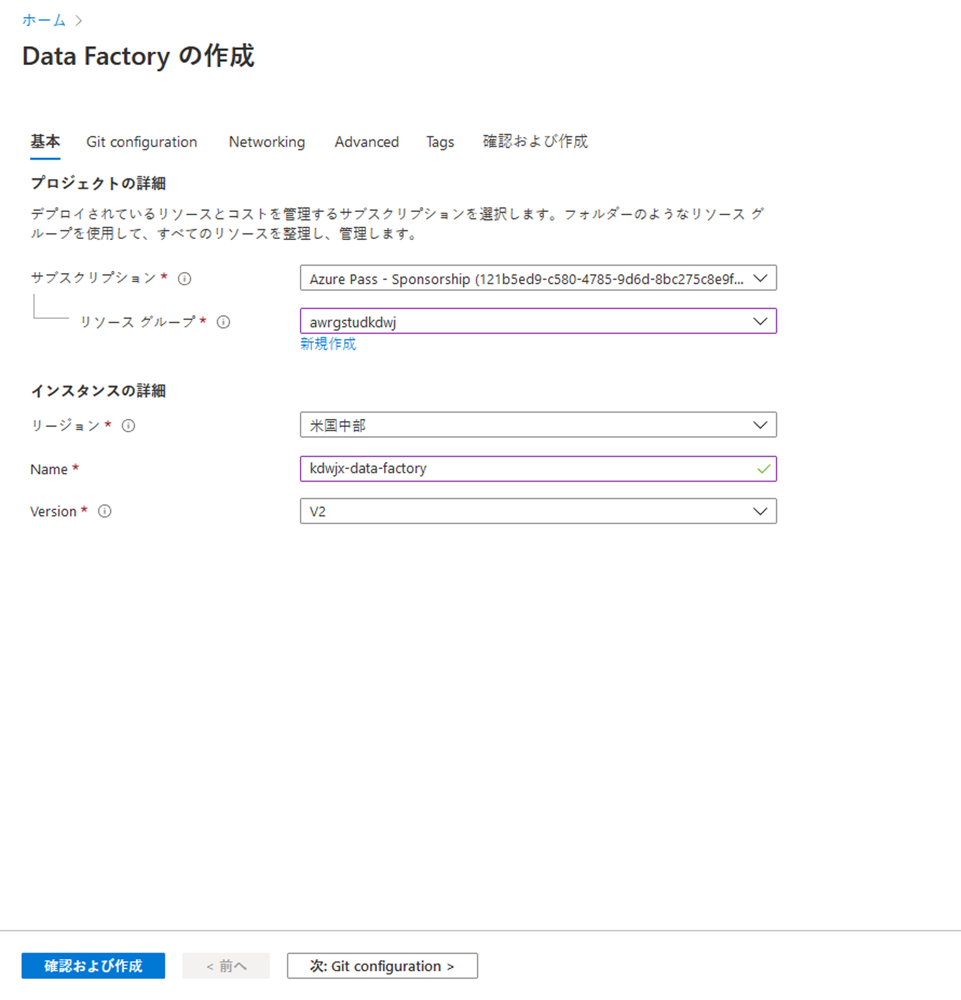
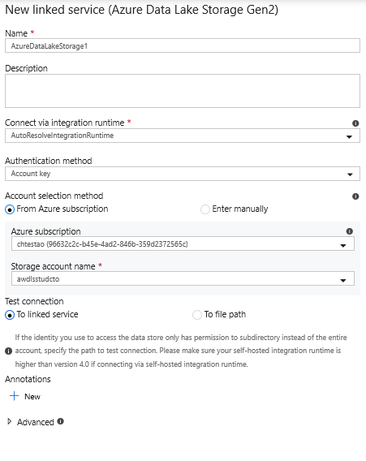
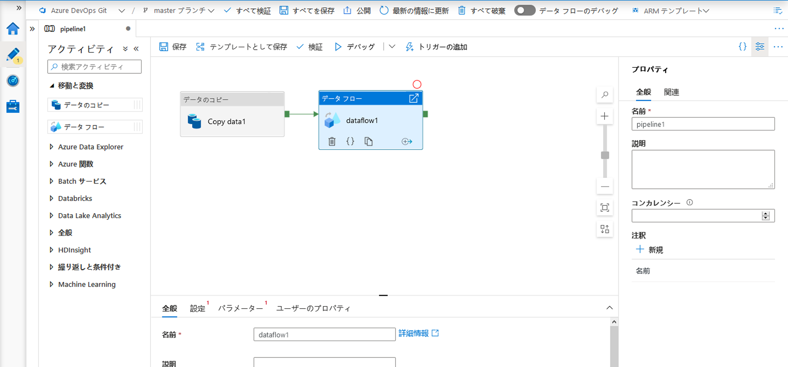
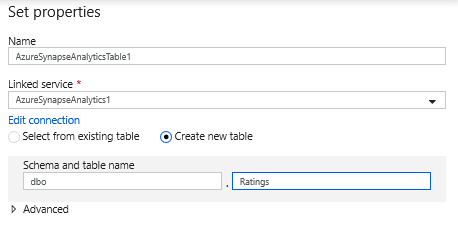
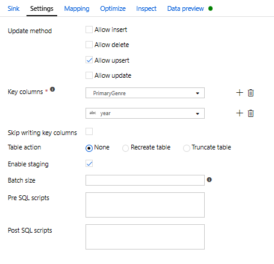

# DP 200 - データ プラットフォーム ソリューションの実装
# ラボ 7 - Azure Data Factory を使用したデータ移動の統合

**予想時間**: 70 分

**前提条件**: この課題のケース スタディは既に確認していることを前提としています。モジュール 1 のコンテンツとラボは次のとおりです：データ エンジニア向け Azure も完了済みであること

* **Azure サブスクリプション**: Azure サブスクリプションをお持ちでない場合は、作成します。
    あなたが始める前に[無料のアカウント](https://azure.microsoft.com/free/)。

* **Azure Data Lake Storage Gen2 のストレージ アカウント**: ADLS を持たない場合には
    Gen2 ストレージ アカウントの手順については、[ADLS Gen2 ストレージを作成する」の手順を参照してください。
    アカウント](https://docs.microsoft.com/en-us/azure/storage/blobs/data-lake-storage-quickstart-create-account)。

* **Azure Streaming Analytics**: Azure Synapse Analytics アカウントがない場合は、[SQL DW を作成する」の手順を参照してください。
    アカウント](https://docs.microsoft.com/en-us/azure/sql-data-warehouse/create-data-warehouse-portal)。

**ラボ ファイル**: この課題のファイルは、_Allfiles\Labfiles\Starter\DP-200.7_ フォルダーにあります。

## ラボの概要

このモジュールでは、Azure Data Factory を使用して、さまざまなデータ プラットフォーム テクノロジーからのデータ移動を統合する方法について説明します。受講者は、テクノロジの機能を説明でき、SQL Database からデータを取り込み、データを Azure Synapse Analytics に読み込む、エンド ツー エンドのデータ パイプラインをセットアップできるようになります。学生はまた、計算リソースの呼び出し方法を示します。

## 課題の目的
  
この課題を完了すると、次のことができるようになります。

1. Azure Data Factory のセットアップ
2. コピー アクティビティを使用したデータの取り込み
3. データ フローのマッピング タスクを使用して変換を実行する
4. コンピューティング リソースを使用した変換の実行

## シナリオ
  
データ ウェアハウスへのデータの抽出、読み込み、変換に役立つツールを評価し、チーム内のデータ エンジニアに Azure Data Factory の概念実証を依頼して、製品の変換機能を調査します。概念実証は AdventureWorks データに関連している必要はないので、機能を表示するために選んだデータセットを選択する自由を与えました。

さらに、データ サイエンティストは、Azure Data Factory から Azure Databricks を呼び出すことができるかどうかを確認するよう求めています。そのために、あなたには Azure Databricks をコンピューティング リソースとして呼び出す Data Factory の概念パイプラインの簡単な証明を作成してもらいます。 

このラボを完了すると:

1. Azure Data Factory のセットアップ
2. コピー アクティビティを使用して取り込んだデータ
3. Mapping Data Flow のタスクを使用した変換
4. コンピューティング リソースを使用して実行した変換

> **重要**: このラボを進めるにつれ、プロビジョニングまたは構成タスクで発生した問題を書き留め、_\Labfiles\DP-200-Issues-Docx_ にあるドキュメントの表に記録してください。課題番号を文書化し、テクノロジを記述し、問題とその解決を説明します。このドキュメントは、後のモジュールで参照できるように保存します。

## 演習 1: Azure Data Factory のセットアップ

推定時間: 15 分

個別エクササイズ

このエクササイズの主なタスクは、以下の通りです。

1. Azure Data Factory のセットアップ

### タスク 1: Azure Data Factory のセットアップ

Data Factory の作成[Azure  portal](https://portal.azure.com) を使用して Data Factory を作成する。 

1. Microsoft Edge で、「Azure portal」 タブに移動し、「**+ リソースの作成**」 のアイコンをクリックし、「**factory**」 と入力します。検索結果から 「**Data Factory**」 をクリックし、「**作成**」をクリックします。

2. New Data Factory スクリーンで、次のオプションを使用して新規 Data Factory を作成します。
    - **サブスクリプション**：お使いのサブスクリプション
    - 「**リソース グループ**」: awrgstudxx x
    - **リージョン**：ユーザーに近い場所を選択します    
    - 「**名前**」: xx-data-factory (xx は自分のイニシャル)
    - 「**バージョン**」: V2
    - 他のオプションを既定の設定のままにします。

        

3. **git 構成** ブレードで、後で 「git を構成する」 を **確認** します。 

4. **「レビューと作成」** をクリックし、**「作成」** をクリックします。 

> **注**: Data Factory の作成には約 1 分かかります。
 
> **結果**: この演習を完了すると、Azure Data Factory のインスタンスが作成されます。

## 演習 2: コピー アクティビティを使用したデータの取り込み
  
推定時間: 15 分

個別エクササイズ
  
このエクササイズの主なタスクは次のとおりです。

1. デザイナーへのコピー アクティビティの追加

2. ソースとして使用する新しい HTTP データセットを作成する

3. 新しい ADLS Gen2 シンクの作成

4. コピー アクティビティのテスト

### タスク 1: デザイナーへのコピー アクティビティの追加

1. デプロイが成功したことを示すメッセージで、「**リソースへ移動**」 ボタンをクリックします。

2. xx-data-factory 画面の中央で、「**作成と監視**」のボタンをクリックします。

3. ADF ホームページから来た場合は、 左側のサイドバーの **「鉛筆アイコン」** をクリックして**「パイプライン」** を選択し、**新しいパイプライン** をクリックして **オーサリング キャンバス** を開きます。

4. **コピー アクティビティを追加する** 「**アクティビティ**」ペインで、「**移動および変換**」を開き、「**データのコピー**」アクティビティをパイプラインキャンバスにドラッグします。

    


### タスク 2: ソースとして使用する新しい HTTP データセットを作成する

1. コピーアクティビティ設定の「ソース」タブで 、「**+ 新規**」 をクリックします。

2. データ ストアの一覧で 、**HTTP** タイルを選択し、「続行」 をクリックします。

3. ファイル形式の一覧で、「**区切り文字形式(DelimitedText)**」 タイルを選択し、「続行」 をクリックします。

4. 「プロパティの設定」 ブレードで、データセットに「**HTTPSource**」 などのわかりやすい名前を付け、「 **リンクされたサービス**」 ドロップダウンをクリックします。HTTP リンク サービスを作成していない場合は、「**新規**」 を選択します。

5. 「**新しいリンクサービス (HTTP)**」 画面で、moviesDB CSVファイルの URL を指定します。次のエンドポイントを使用して、認証を必要としないデータにアクセスできます。

    https://raw.githubusercontent.com/djpmsft/adf-ready-demo/master/moviesDB.csv

6. これを 「**ベース URL**」 ボックスに入力します。 

7. 「**認証の種類**」 ドロップダウンで 「**匿名**」 を選択し、「**作成**」 をクリックします。


    -  リンクされたサービスを作成して選択したら、データセットの残りの設定を指定します。これらの設定では、取得したいデータを接続のどこから、どのように持ってくるのか指定します。URL が既にファイルを指している場合、**相対URL** は必要ありません。データの最初の行にヘッダーが含まれるので、「**先頭行をヘッダーとして**」 にチェックをつけ、「**スキーマのインポート**」で 「**接続またはストアから**」 を選択し、ファイル自体からスキーマを取得します。要求メソッドとして 「**GET**」 を選択します。以下のページが表示されます。

        
           
    - 完了したら、「**OK**」 をクリックします。
   
    a. データセットが正しく構成されていることを確認するには、コピー アクティビティの 「**ソース**」 タブの 「 **データのプレビュー**」 をクリックして、データの小さなスナップショットを取得します。
   
   

### タスク 3: 新しい ADLS Gen2 データセット シンクの作成

1. 「**シンク**」 タブをクリックし 、「**+ 新規**」 をクリックします。

2. 「**Azure Data Lake Storage Gen2**」 のタイルを選択し、「**続行**」 を選択します。

3. 「**区切り文字形式(DelimitedText)**」タイルを選択し、「**続行**」 をクリックします。

4. 「プロパティの設定」 ブレードで、データセットに 「**ADLSG2**」 などのわかりやすい名前を付け、「**リンクされたサービス**」 ドロップダウンをクリックします。ADLS リンク サービスを作成していない場合は、「**新規**」 を選択します。

5. 「新しいリンクされたサービス (Azure Data Lake Storage Gen2)」 ブレードで、認証方法として 「**アカウント キー**」 を選択し、「**Azure サブスクリプション**」 を選択して、「ストレージ アカウント名」として 「**awdlsstudxx**」 を選択します。次のような画面が表示されます。

   

6. 「**作成**」 をクリックします

7. **プロパティの設定** 画面で、リンクサービスとして先ほど作成したリンクが表示されていることを確認します。

8. **ファイルパス** で、moviesDB.csv のコピー先フォルダーを指定します。次の例では、ファイル システム 「**data**」の「**output**」フォルダに書き込みます。フォルダーは動的に作成されますが、ファイル システムは、書き込む前に存在していなければなりません。

9. **先頭行をヘッダーとして**をチェックします。

10. **スキーマのインポート** で **サンプルファイルから** を選択し、**Labfiles\Starter\DP-200.7\SampleFiles**から **moviesDB.csv** ファイルをインポートします。  

   

8. 完了したら、「**OK**」 をクリックします。

### タスク 4: コピー アクティビティのテスト

これでコピー アクティビティの設定は完了です。テストするには、 パイプライン キャンバスの上部にある 「**デバッグ**」 ボタンをクリックします。パイプライン デバッグが実行されます。

1. パイプライン デバッグの実行をモニターするには、 パイプラインの 「**出力**」 タブをクリックしてください。

2. アクティビティ出力の詳細な説明を表示するには、**眼鏡**のアイコンをクリックします。これにより、データの読み取り/書き込み、スループット、詳細な時間の統計値など、有益な指標を提供するコピーのモニター画面が開きます。

   

3. コピーが正常に動作することを確認するには、ADLS Gen2 ストレージ アカウントを開き、ファイルが正常に書き込まれたかどうかを確認します。


## 演習 3: Mapping Data Flow によるデータ変換
  
推定時間: 30 分

個別エクササイズ

データを Azure Data Lake Store Gen2 に移動したので、Spark クラスターを使用して大量のデータを変換し、Data Warehouse に読み込むマッピング データ フローを構築する準備ができました。 
  
このエクササイズの主なタスクは次のとおりです。

1. 環境の準備

2. データ ソースの追加

3. マッピング データ フロー変換の使用

4. データ シンクへの書き込み

5. パイプラインの実行

### タスク 1: 環境の準備

1. **データ フローのデバッグを有効にする**  オーサリング モジュールの上部にある「**データ フローのデバッグ**」 スライダーをオンにします。 

    > 注: データ フロー クラスターのウォームアップには 5 ~ 7 分かかります。

2. **データ フロー アクティビティの追加** 「アクティビティ」 ペインで、「**移動および変換**」 アコーディオンを開き、 「**データ フロー**」 アクティビティをパイプライン キャンバスにドラッグします。 

    

3. **設定** タブで、変数 **データ フロー** の **「+ 新規」** をクリックします。

### タスク 2: データ ソースの追加

1. **ADLS ソースを追加**  データ フロー キャンバスの 「ソースの追加」 ボタンをクリックします。「**ソースの設定**」タブの「**データセット**」 ドロップダウンで、コピー アクティビティの出力である **ADLSG2** データセットを選択します。

    


    * データセットが他のファイルのあるフォルダを指している場合は、別のデータセットを作成するか、パラメーター化を利用して moviesDB.csv ファイルのみを読み取るようにする必要があります。
    * ADLS でスキーマをインポートしていないが、既にデータを取り込んでいる場合は、データセットの 「スキーマ」 タブに移動し、「スキーマのインポート」 をクリックして、データ フローにスキーマ情報を取り込みます。

    デバッグ クラスターがウォームアップされたら、「データ プレビュー」 タブでデータが正しく読み込まれているか確認します。更新ボタンをクリックすると、それぞれの変換時にデータがどのような状態になるか計算したスナップショットが Mapping Data Flow に表示されます。
  
### タスク 3: マッピング データ フロー変換の使用

1. **列を変更および削除するために Select 変換を追加する** 

データのプレビューで、「Rotton Tomato」 列のスペルが間違っていることに気が付いたはずです（正しくは Rotten Tomatoes」）。この名前を正しく指定したり、「Rating」列を削除したいときは、ADLS ソース ノード **Source1** の横にある 「+」 アイコンをクリックして、「スキーマ装飾子」 の下の 「選択(Select)」 を選択すると、[Select 変換](https://docs.microsoft.com/azure/data-factory/data-flow-select) を追加できます。
    
    

    「**出力ストリーム名**」を「Select」などの英語に変更してください。日本語を使用することはできません。
    
    「**入力列**」のフィールドで、'Rotton'を'Rotten'に変更します。
    
    「Rating」 列を削除するには、その列をチェックしてごみ箱アイコンをクリックします。

    

2. **不要な年を除外するフィルター変換を追加** 1951年以降に作られた映画にのみ興味があるとします。[フィルター変換](https://docs.microsoft.com/azure/data-factory/data-flow-filter) を追加してフィルター条件を指定するには、Select 変換の横にある 「**+**」アイコンをクリックし、「**行装飾子**」の下の「フィルター」を選択します。

    **出力ストリーム名** を英語に変更してください。
    
    **フィルターオン** の横にあるボックスをクリックして[**ビジュアル式ビルダ**](https://docs.microsoft.com/azure/data-factory/concepts-data-flow-expression-builder)を開き、フィルター条件を入力します。[Mapping Data Flow の式言語](https://docs.microsoft.com/azure/data-factory/data-flow-expression-functions)の構文を使用し、「**toInteger(year) > 1950**」と入力すると、文字列である年の値を整数に変換し、値が 1950 を超える行をフィルターします。

    

    下にある **データ プレビュー** で **最新の情報に更新** を使用して、条件が正しく機能していることを確認できます

    
    
    確認ができたら、「保存して終了」をクリックします。

4. **主要ジャンルを計算する派生変換を追加**  

    お気づきかもしれませんが、ジャンル(genres) 列は **|** で区切られた文字列です。各行の *最初* のジャンルだけを対象にする場合は、フィルター変換の横にある **+アイコン**を クリックし、「スキーマ修飾子」 で 「**派生列**」 を選択することで、[派生列](https://docs.microsoft.com/azure/data-factory/data-flow-derived-column)変換を使用して「**PrimaryGenre**」という名前の新しい列を派生させることができます。フィルター変換と同様に、派生列ではマッピング データ フローの**式ビルダー**を使用して、新しい列の値を指定します。

    

    このシナリオでは、'genre1 として書式設定される genres 列から最初のジャンルを抽出してみます。
    
    出力ストリーム名を **DerivedColumnTransformation** など、英語の名称に変更してください。
    
    **式ビルダー** をクリックして**ビジュアル式ビルダー** を開きます。
        
    列名に **PrimaryGenre** とします。
    
    **locate** 関数を使用すると、 最初の "**|**" の場所を取得することができます。この値が1以上の場合は、"**|**" が genres 列に存在します。
    
    **iif** 関数を使用して、条件に基づいて、2 つの値のいずれかを選択することができます。locate 関数の値が 1 より大きい場合は、**left** 関数経由でプライマリ ジャンルを特定できます。それ以外の場合、PrimaryGenre の値は Genre フィールドと等しくなります。
    
    ```
    iif(locate('|',genres) > 1, left(genres, locate('|', genres) -1), genres)
    ```
    
    出力は、式ビルダーの 「データ プレビュー」 ウィンドウで確認できます。
    
    設定が完了したら「**保存して終了**」をクリックします。
   
4. **ウィンドウ変換を介して映画をランク付け**  

    特定ジャンルの映画の年間ランキングに興味があるとします。派生列変換の横にある 「**+ アイコン**」 をクリックし、スキーマ修飾子の下の 「**ウィンドウ**」 をクリックすることで、ウィンドウ ベースの集計を定義するために「[ウィンドウ変換](https://docs.microsoft.com/azure/data-factory/data-flow-window)」を追加できます。
    
    これを実現するには、ウィンドウの表示方法、並べ替え方法、範囲、新しいウィンドウ列の計算方法を指定します。この例では、PrimaryGenre と範囲無制限の年でウィンドウを設定し、Rotten Tomato の降順で並べ替え、各映画の特定のジャンル年におけるランクに等しい RatingsRank という新しい列を計算します。
    
    出力ストリーム名を Windowing 等、英語名に変更してください。

    

    順序を**降順**に設定してください。
    

    

    


5. **集計変換でレーティングを集計する** 必要なデータはすべて収集して抽出したので、「ウィンドウ変換」の隣の [「+」 アイコン](https://docs.microsoft.com/azure/data-factory/data-flow-aggregate)、「集約」 の順にクリックして、必要なグループに基づいて指標を計算する**集計変換**を追加できます。ウィンドウの変換で行ったように、PrimaryGenre および年ごとに映画をグループ化できます

    出力ストリーム名を「**aggregate**」等の英語に置き換えてください。
    
    

    「集約」 タブでは、列で指定したグループで集計できます。すべてのジャンルと年ごとに、Rotten Tomatoes評価の平均値、最高評価と最低評価の映画(ウィンドウ機能を利用)、各グループ内の映画の数を取得することができます。集計では、変換ストリームの行数が大幅に減少し、変換で指定されたグループ化と集計列のみが反映されます。

    

    * 集計変換によってデータがどのように変化するかを確認するには、「データ プレビュー」 タブを使用します。
   

6. **行の変更変換を使用して アップサート条件を指定する**  

    表形式のシンクに書き込む場合は、「集計変換」の横にある 「+ アイコン」をクリックし、「行修飾子」 下の 「行の変更」 をクリックして、「[行の変更変換](https://docs.microsoft.com/azure/data-factory/data-flow-alter-row)」を追加し、行の挿入、削除、更新、アップサート ポリシーを設定します。挿入や更新は常に行われるため、すべての行を常にアップサートするよう指定することができます。

    

    

### タスク 4: データ シンクへの書き込み

1. **Azure Synapse Analytics シンクに書き込む** 

    すべての変換ロジックが完了したので、シンクに書き込む準備が整いました。
    1. 「**シンク**」を追加するには、「UpsertifTrue」の横にある 「**+アイコン**」をクリックし、「宛先」の下の「**シンク**」をクリックします。
    1. 「シンク」 タブで、「**+ 新規ボタン**」 を使用して新しい Data Warehouse データセットを作成します。
    1. タイル リストから 「**Azure Synapse Analytics**」 を選択します。
    1. 新しいリンクされたサービスを選択し、モジュール 5 で作成した DWDB データベースに接続するように Azure Synapse Analytics 接続を構成します。完了したら、「**作成**」 をクリックします。
    
    1. データセットの構成で、「**新しいテーブルを作成する**」 を選択し、スキーマとして 「**Dbo**」、テーブル名として「**Ratings**」を入力します。完了したら、「**OK**」 をクリックします。
    
    1. upsert 条件が指定されているため、「設定」 タブに移動し、主キー列である PrimaryGenre とyear に基づいて 「upsert を許可」 を選択します。
    
これで、8 つの変換マッピング データ フローの構築が完了しました。パイプラインを実行して結果を確認してみましょう！


## タスク 5: パイプラインの実行

1. キャンバスの 「pipeline1」 タブに移動します。Data Flow の Azure Synapse Analytics では [PolyBase](https://docs.microsoft.com/sql/relational-databases/polybase/polybase-guide?view=sql-server-2017) が使用されるため、BLOB または ADLS ステージング フォルダーを指定する必要があります。「データ フローの実行」 アクティビティの設定タブで、PolyBase アコーディオンを開き、ADLS にリンクされたサービスを選択し、ステージング フォルダーのパスを指定します。

    

2. パイプラインを発行する前に、デバッグを実行して、期待どおりに動作していることを確認します。「出力」 タブでは、実行中の両方のアクティビティの状態をモニターできます。

3. 両方のアクティビティが成功したら、データ フロー アクティビティの横にある眼鏡アイコンをクリックすると、データ フローの実行をより詳細に確認できます。

4. この課題で説明したのと同じロジックを使用した場合、Data Flow は SQL DW に 737 行を書き込みます。[SQL Server Management Studio](https://docs.microsoft.com/sql/ssms/download-sql-server-management-studio-ssms?view=sql-server-2017) に移動して、パイプラインが正常に動作したこと、および書き込まれた内容を確認することできます。

    

## 演習 4: Azure Data Factory と Databricks
  
推定時間: 15 分

個別エクササイズ
  
このエクササイズの主なタスクは次のとおりです。

1. Databricks アクセス トークンを生成します。

2. Databricks Notebook を生成する。

3. リンクされたサービスを作成する

4. Databricks Notebook アクティビティを使用するパイプラインを作成します。

5. パイプライン実行をトリガーする。

### タスク 1: Databricks アクセス トークンを生成します。

1. Azure portal で、「**リソース グループ**」、「**awrgstudxx**」、「**awdbwsstudxx**」 の順にクリックします (xx は自分の名前のイニシャル)。

2. 「**ワークスペースを起動**」 をクリックする

3. Databricks ワークスペースの右上隅にあるユーザー **プロファイル アイコン** をクリックします。

4. 「**User Settings**」 (ユーザー設定) をクリックします。

5. 「アクセス トークン」 タブに移動し、「**Generate New Token**」 (新しいトークンの生成)をクリックします。

6. 「ADF 統合用」の **コメント** に説明を入力し、**有効期間** を 10 日間に設定し、「**生成**」 をクリックします。

7. 生成されたトークンをコピーし、メモ帳に保存し、「**完了**」 をクリックします。

### タスク 2: Databricks Notebook を生成する。

1. 画面の左側にある 「**Workspace**」 アイコンをクリックしてから, 「Workspace」 という単語の横にある矢印をクリックし、「**Create**」 をクリックした後、「**Folder**」 をクリックします。フォルダーに **adftutorial** という名前を付け、「**Create Folder**」 をクリックします。adftutorial フォルダーが Workspace の下に表示されます。

2. adftutorial を選択し、adftutorial の横にあるドロップダウン矢印、「**Create**」、「**Notebook**」、の順にクリックします。

3. 「Create Notebook」 ダイアログ ボックスで「**mynotebook**」 の名前を入力し、言語が **Python** を指定していることを確認して、「**作成**」 をクリックします。「mynotebook」がタイトルのノートブックが表示されます/

4. 新しく作成されたノートブック 「mynotebook」 に次のコードを追加します。

    ```Python
    # Creating widgets for leveraging parameters, and printing the parameters

    dbutils.widgets.text("input", "","")
    dbutils.widgets.get("input")
    y = getArgument("input")
    print ("Param -\'input':")
    print (y)
    ```

    > ノートブックのパスは **/adftutorial/mynotebook** ですので **注意** してください。

### タスク 3: リンクされたサービスを作成する

1. Microsoft Edge で、Azure portal のポータル タブをクリックし、Azure Data Factory に戻ります。

2. **xx-data-factory** 画面で、「**管理**」 をクリックします。Azure Data Factory ソリューションを作成するために新しいタブが開きます。

4. 「**接続**」 の下にある「**リンクサービス**」をクリックし、「**+ 新規**」 をクリックします。

5. 「**新しいリンクサービス**」 の画面上部で、「**コンピューティング**」 をクリックしてから 「**Azure Databricks**」 をクリックし、「**続行**」 をクリックします。

6. 「**新しいリンクサービス (Azure Databricks)**」 画面で次の詳細を入力し、「**完了**」 をクリックします。
    - **名前**: xx_dbls (xx は自分のイニシャル)
    - **Databricks ワークスペース:** awdbwsstudxx (xx は自分のイニシャル)
    - **クラスターの選択**: 既存を使用します
    - **ドメイン/リージョン**: 入力する必要があります
    - **アクセス トークン**: Notepad からアクセス トークンをコピーし、このフィールドに貼り付ける
    - **既存のクラスターから選択する**: awdbclstudxx (xx は自分のイニシャル)
    - 他のオプションを既定の設定のままにします。

    > **注**: 終了をクリックすると、xx_dbls が作成され、 「**作成者とモニター**」 画面に戻ります。その他のリンクト サービスは前回のエクササイズで作成されています。

### タスク 5: Databricks Notebook アクティビティを使用するパイプラインを作成します。

1. 画面の左側にある「**作成者**」をクリックし、「ファクトリ リソース」 の下で、**+** アイコンをクリックし、「**パイプライン**」 をクリックします。これにより、パイプライン デザイナーのあるタブが開きます。

2. パイプライン デザイナーの下部にある 「パラメーター」 タブをクリックし、「**+ 新規**」をクリックします。

3. **name** の名前と **文字列** のタイプを有するパラメーターを作成します。

4. 「**アクティビティ**」 メニューで、「**Databricks**」 を展開します。

5.  「**ノートブック**」 をクリックしてキャンバスにドラッグします。

6. 下部にある 「**Notebook1**」 ウィンドウのプロパティで、次の手順を実行します。
    - 「**Azure Databricks**」 タブに移動します。
    - 前の手順で作成した **xx_dbls** を選択します。

    - 「**設定**」 タブに切り替え、ノートブック パスに **/adftutorial/mynotebook** と入力します。
    - 「**ベースパラメタ**」 (基本パラメーター) を展開し、「**+ 新規**」 をクリックします。
    - 名前が **input** で値が **@pipeline().parameters.name** のパラメーターを作成します。

7. **Notebook1** で、「テンプレートとして保存」 ボタンの横にある 「**検証**」 をクリックします。画面の右側にウィンドウが表示され、「パイプラインが検証されました。
エラーは見つかりませんでした。」と表示されます。「>>」 をクリックしてウィンドウを閉じます。

8. リンクされたサービスとパイプラインを公開するには、「**すべて公開**」をクリックします。

9. 「すべて公開」ウィンドウで、「**公開**」をクリックします。

    > **注**: 展開が成功したことを知らせるメッセージが表示されます。

### タスク 6: パイプライン実行をトリガーする

1. **Notebook1** で、「**トリガーの追加**」をクリックし、「**今すぐトリガー**」をクリックします。

2. 「**パイプライン実行**」 ダイアログで、名前パラメーターが要求されます。ここで、パラメーターとして **/path/filename** を使用します。「完了」 をクリックします。キャンバスの Notebook1 アクティビティの上に赤い円が表示されます。

### タスク 7: パイプラインをモニターする

1. スクリーンの左側で、「**モニター**」 タブをクリックします。パイプラインが実行されていることを確認します。ノートブックが実行される Databricks ジョブ クラスターを作成するには、5 分から 8 分ほどかかります。

2. 「**更新**」 を定期的に選択して、パイプライン実行の状態を確認します。

3. パイプラインの実行に関連付けられたアクティビティの実行を表示するには、パイプライン名をクリックします。

### タスク 8: 出力を検証する

1. **アクティビティの実行** ページで、Notebook1 アクティビティの「**眼鏡**」アイコンをクリックすると、「**実行ページ**」URLが表示されるので、クリックします。

2. **Azure Databricks** のジョブページが開き、**Output**に実行結果が表示されていることがわかります。

